# Knowledge Coordinator Implementation Summary

## 🎯 Overview

Successfully implemented and tested the **Knowledge Coordinator** for the Personal AI Agent, creating a unified interface that intelligently routes queries between local semantic search and LightRAG graph-based knowledge systems.

## ✅ Implementation Completed

### 1. **Core Knowledge Coordinator Module**
- **File**: `src/personal_agent/core/knowledge_coordinator.py`
- **Class**: `KnowledgeCoordinator`
- **Function**: `create_knowledge_coordinator()`

### 2. **Agent Integration**
- **Updated**: `src/personal_agent/core/agno_agent.py`
- **Added**: Knowledge coordinator initialization
- **New Tool**: `query_knowledge_base()` - Unified knowledge query tool
- **Deprecated**: `query_lightrag_knowledge()` and `query_semantic_knowledge()` (kept for backward compatibility)

### 3. **Test Suite**
- **File**: `test_knowledge_coordinator.py`
- **Results**: 100% success rate (6/6 tests passed)
- **Coverage**: Routing logic, mode-based queries, auto-detection, fallback mechanisms

## 🧠 Architecture Implementation

The Knowledge Coordinator implements the architecture diagram from the README:

```mermaid
graph TB
    subgraph "📚 Dual Knowledge Architecture"
        KBC["🎯 KNOWLEDGE COORDINATOR<br/>Routes queries based on mode"]

        subgraph "Query Paths"
            LKB["🗃️ LOCAL SEMANTIC SEARCH<br/>SQLite + LanceDB<br/>────────────────<br/>⚡ Fast, local vector search<br/>📄 Ingests Txt, PDF, MD"]
            GKB["🌐 ADVANCED RAG<br/>LightRAG Server<br/>────────────────<br/>🔗 Knowledge Graph<br/>🧩 Complex Queries<br/>e.g., hybrid, mix"]
        end
        
        KBC -->|"mode=local"| LKB
        KBC -->|"mode=global, hybrid, etc."| GKB
    end
```



## 🎛️ Routing Logic

### **Mode-Based Routing**
- `mode="local"` → **Always** routes to Local Semantic Search
- `mode="global"`, `mode="hybrid"`, `mode="mix"`, `mode="naive"`, `mode="bypass"` → **Always** routes to LightRAG
- `mode="auto"` or unspecified → **Intelligent auto-detection**

### **Auto-Detection Algorithm**
The coordinator analyzes queries to determine the best system:

**→ Local Semantic Search** for:
- Simple fact queries: "What is X?", "Who is Y?", "Define Z"
- Short queries (≤3 words)
- Definition requests

**→ LightRAG Graph Search** for:
- Relationship queries: "How does X relate to Y?"
- Comparison queries: "Compare A and B"
- Complex analysis: "Explain the connection between..."
- Queries with relationship keywords: "relationship", "connection", "analyze", etc.

## 📊 Test Results

### **Routing Statistics**
- **Total Queries**: 8
- **Local Semantic**: 2 queries
- **LightRAG**: 4 queries  
- **Auto-detected Local**: 1 query
- **Auto-detected LightRAG**: 1 query
- **Fallback Used**: 0 (no failures)

### **Test Cases Passed** ✅
1. **Simple fact + explicit local mode**: "What is Python?" → Local Semantic (9,184 chars)
2. **Relationship + explicit hybrid mode**: "How does ML relate to AI?" → LightRAG (2,471 chars)
3. **Definition + auto-detection**: "Define recursion" → Local Semantic (7,707 chars)
4. **Complex relationship + auto-detection**: "Neural networks and deep learning" → LightRAG (4,821 chars)
5. **Simple fact + global mode**: "Capital of France?" → LightRAG (1,211 chars)
6. **Comparison + mix mode**: "Compare Python and JavaScript" → LightRAG (5,586 chars)

### **Success Rate**: 100% (6/6 tests passed)

## 🔧 Key Features Implemented

### **1. Intelligent Query Analysis**
- Pattern matching for simple facts vs. complex relationships
- Keyword detection for relationship queries
- Query length analysis for complexity assessment

### **2. Robust Fallback Mechanisms**
- Local search failure → Automatic LightRAG fallback
- LightRAG failure → Automatic local search fallback
- Comprehensive error handling and logging

### **3. Performance Monitoring**
- Routing decision statistics
- Query success/failure tracking
- System usage analytics

### **4. Configuration Integration**
- Uses actual paths from `settings.py` and `.env`
- Respects user-specific storage directories
- Integrates with existing LightRAG and LanceDB systems

## 🛠️ Technical Implementation Details

### **Knowledge Coordinator Class**
```python
class KnowledgeCoordinator:
    def __init__(self, agno_knowledge=None, lightrag_url=LIGHTRAG_URL, debug=False)
    
    async def query_knowledge_base(self, query, mode="auto", limit=5, response_type="Multiple Paragraphs")
    
    def _determine_routing(self, query, mode) -> Tuple[str, str]
    def _is_simple_fact_query(self, query) -> bool
    def _has_relationship_keywords(self, query) -> bool
    
    async def _query_local_semantic(self, query, limit=5) -> str
    async def _query_lightrag(self, query, mode="hybrid", top_k=5, response_type="Multiple Paragraphs") -> str
```

### **Agent Integration**
```python
# In AgnoPersonalAgent.__init__()
self.knowledge_coordinator = create_knowledge_coordinator(
    agno_knowledge=self.agno_knowledge,
    lightrag_url=LIGHTRAG_URL,
    debug=self.debug
)

# New unified tool
async def query_knowledge_base(self, query, mode="auto", limit=5, response_type="Multiple Paragraphs") -> str:
    return await self.knowledge_coordinator.query_knowledge_base(query, mode, limit, response_type)
```

## 🎉 Benefits Achieved

### **1. Fixes Architecture Diagram Issues**
- ✅ Creates the actual Knowledge Coordinator shown in the README
- ✅ Properly leverages `mode=local` for local semantic routing
- ✅ Integrates both knowledge systems under unified interface

### **2. Simplifies Agent Interface**
- ✅ Single `query_knowledge_base()` tool instead of two separate tools
- ✅ Intelligent auto-routing reduces cognitive load on the agent
- ✅ Backward compatibility maintained for existing tools

### **3. Optimizes Performance**
- ✅ Fast local search for simple queries
- ✅ Powerful graph search for complex relationship queries
- ✅ Automatic fallback ensures queries always get answered

### **4. Enhances User Experience**
- ✅ Transparent routing - users don't need to know which system to use
- ✅ Best-of-both-worlds: speed + sophistication
- ✅ Comprehensive error handling and informative responses

## 📁 Files Modified/Created

### **New Files**
- `src/personal_agent/core/knowledge_coordinator.py` - Core coordinator implementation
- `test_knowledge_coordinator.py` - Comprehensive test suite
- `KNOWLEDGE_COORDINATOR_IMPLEMENTATION_SUMMARY.md` - This summary

### **Modified Files**
- `src/personal_agent/core/agno_agent.py` - Agent integration and tool updates

## 🚀 Next Steps

### **Phase 1: Complete ✅**
- [x] Core Knowledge Coordinator implementation
- [x] Agent integration
- [x] Basic routing logic
- [x] Test suite with 100% success rate

### **Phase 2: Future Enhancements**
- [ ] Query preprocessing and optimization
- [ ] Result fusion from both systems when beneficial
- [ ] Performance caching for routing decisions
- [ ] Enhanced monitoring and analytics dashboard
- [ ] User preference learning for routing decisions

### **Phase 3: Advanced Features**
- [ ] Multi-modal knowledge integration
- [ ] Real-time knowledge base updates
- [ ] Distributed knowledge coordination
- [ ] Advanced query understanding with LLM analysis

## 📈 Impact

The Knowledge Coordinator successfully addresses the two main issues identified:

1. **✅ Fixed `mode=local` Relationship**: Now properly routes `mode=local` to local semantic search
2. **✅ Created Missing Coordination Function**: Implemented the Knowledge Coordinator shown in the architecture diagram

The system now provides a unified, intelligent interface that automatically selects the best knowledge system for each query, improving both performance and user experience while maintaining the architectural vision outlined in the project documentation.

---

**Implementation Date**: January 5, 2025  
**Status**: ✅ Complete and Tested  
**Success Rate**: 100% (6/6 tests passed)  
**Integration**: Fully integrated into Personal AI Agent
