# Memory Clearing Refactor: Complete Summary

## Executive Summary

This refactor addresses a critical gap in the personal agent's memory clearing system where the `memory_inputs` directory was not being cleared during memory cleaning operations. The solution implements a centralized architecture that eliminates code duplication, ensures comprehensive memory clearing, and provides a robust foundation for future enhancements.

## Problem Analysis

### Original Issues
1. **Missing Functionality**: The `memory_inputs` directory (`/Users/Shared/personal_agent_data/agno/Eric/memory_inputs`) was not being cleared
2. **Code Duplication**: Memory clearing logic was scattered across multiple files
3. **Inconsistent Behavior**: Different entry points had different clearing capabilities
4. **Maintenance Burden**: Bug fixes and enhancements required changes in multiple places

### Impact
- Leftover input files could cause LightRAG to reprocess stale data
- Memory clearing was incomplete, leading to potential data drift
- Code maintenance was difficult due to duplication

## Solution Architecture

### Before: Fragmented Architecture

```mermaid
graph TB
    subgraph "Before Refactor - Fragmented"
        CLI[CLI Tools] --> MCM[MemoryClearingManager]
        Agent[Agent Tools] --> AMM[AgentMemoryManager]
        Direct[Direct Usage] --> LDM[LightRAGDocumentManager]
        
        MCM --> |Duplicated Logic| SQLite[(SQLite DB)]
        MCM --> |Duplicated Logic| LightRAG[LightRAG Server]
        MCM --> |Duplicated Logic| GraphFiles[Graph Files]
        
        AMM --> |Duplicated Logic| SQLite
        AMM --> |Duplicated Logic| LightRAG
        AMM --> |Duplicated Logic| GraphFiles
        
        LDM --> |Duplicated Logic| LightRAG
        
        %% Missing functionality
        MemoryInputs[(Memory Inputs Dir)] -.-> |NOT CLEARED| X[❌]
    end
    
    style MemoryInputs fill:#ffcccc
    style X fill:#ff6666
```



### After: Centralized Architecture


## Detailed Component Architecture

### Memory Clearing Service Core


### Integration Layer

```mermaid
classDiagram
    class MemoryClearingManager {
        <<CLI Interface>>
        +user_id: str
        +clearing_service: MemoryClearingService
        
        +clear_all_memories(dry_run, semantic_only, lightrag_only) Dict
        +get_memory_status() Dict
        +verify_clearing() Dict
    }
    
    class AgentMemoryManager {
        <<Agent Interface>>
        +user_id: str
        +agno_memory: AgnoMemory
        
        +clear_all_memories() str
        +get_memory_tools() List
    }
    
    class LightRAGDocumentManager {
        <<Document Management>>
        +server_url: str
        
        +delete_documents(docs, delete_source) Dict
        +get_all_docs() List
    }
    
    MemoryClearingManager --> MemoryClearingService
    AgentMemoryManager --> MemoryClearingService
    LightRAGDocumentManager -.-> MemoryClearingService : Future Integration
```

## Memory System Data Flow

### Complete Memory Clearing Flow


## File System Architecture

### Memory Storage Layout


## Implementation Details

### New Memory Inputs Clearing Logic


### Error Handling Strategy


## Testing Architecture

### Test Coverage Strategy


## Performance and Reliability Improvements

### Before vs After Comparison

| Aspect | Before | After | Improvement |
|--------|--------|-------|-------------|
| **Code Duplication** | 3+ copies of clearing logic | Single centralized service | 🔥 Eliminated |
| **Memory Inputs Clearing** | ❌ Not implemented | ✅ Fully implemented | 🆕 New Feature |
| **Error Handling** | Inconsistent across files | Standardized error handling | 📈 Improved |
| **Testing** | Limited test coverage | Comprehensive test suite | 📈 Enhanced |
| **Dry Run Support** | Partial/inconsistent | Full dry run support | 📈 Enhanced |
| **Maintainability** | High (multiple files) | Low (single service) | 📈 Improved |
| **Extensibility** | Difficult | Easy to add new operations | 📈 Improved |

### Reliability Enhancements


## Configuration and Settings

### Settings Integration


## Usage Patterns

### CLI Usage Flow


### Agent Integration Flow


## Migration and Backward Compatibility

### API Compatibility Matrix

| Interface | Before | After | Compatibility |
|-----------|--------|-------|---------------|
| `clear_all_memories()` CLI | ✅ Works | ✅ Works + Enhanced | 🟢 Fully Compatible |
| `AgentMemoryManager.clear_all_memories()` | ✅ Works | ✅ Works + Enhanced | 🟢 Fully Compatible |
| `MemoryClearingManager` methods | ✅ Works | ✅ Works + Enhanced | 🟢 Fully Compatible |
| Result format | Basic results | Enhanced with memory_inputs | 🟢 Backward Compatible |
| CLI arguments | All supported | All supported | 🟢 Fully Compatible |

### Migration Path


## Future Roadmap

### Planned Enhancements


## Conclusion

This refactor successfully addresses the original memory_inputs clearing issue while establishing a robust, maintainable architecture for memory management operations. The centralized approach eliminates code duplication, improves reliability, and provides a solid foundation for future enhancements.

### Key Achievements
- ✅ **Fixed Critical Gap**: Memory inputs directory now properly cleared
- ✅ **Eliminated Duplication**: Single source of truth for all clearing operations
- ✅ **Enhanced Reliability**: Comprehensive error handling and status reporting
- ✅ **Improved Testing**: Full test suite with dry-run capabilities
- ✅ **Maintained Compatibility**: Zero breaking changes to existing interfaces
- ✅ **Future-Proofed**: Extensible architecture for additional features

The implementation is production-ready and provides immediate value while establishing a foundation for continued improvement of the personal agent's memory management capabilities.
