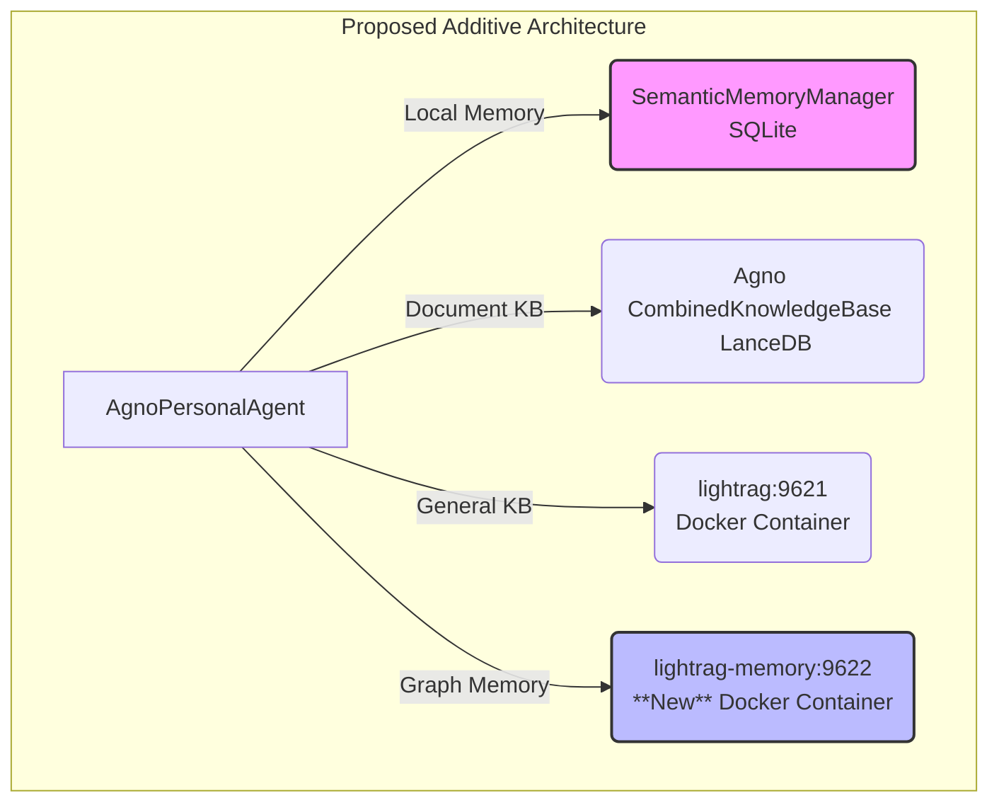

# Plan: Augmenting Agent Memory with a Dedicated LightRAG Service

This document outlines the plan to augment the Personal AI Agent with a new, dedicated, containerized LightRAG service for graph-based user memory, running in parallel with the existing memory systems.

## 1. Analysis of Current & Proposed Architecture

### Current State

The agent currently utilizes three distinct memory and knowledge systems:

1.  **Local User Memory:** A fast, LLM-free semantic search system using `SemanticMemoryManager` and a local SQLite database.
2.  **Document Knowledge Base:** An `agno` `CombinedKnowledgeBase` using LanceDB for storing and retrieving user-provided documents.
3.  **General Knowledge:** A containerized LightRAG service (`lightrag:9621`) for general-purpose RAG and knowledge graph queries.

### Proposed Additive Architecture

The goal is to **add** a fourth system, not replace any existing ones. This new system will be a dedicated LightRAG instance for user memories, enabling powerful knowledge graph capabilities for personal information.

---

## 2. Detailed Implementation Plan

### Phase 1: Infrastructure Setup - The New Memory Service

This phase focuses on creating the new, isolated LightRAG service for user memories.

1.  **Create New Service Directory:**
    *   Create a new directory at the project root: `lightrag_memory_server/`.

2.  **Create New Docker Compose File:**
    *   Create `lightrag_memory_server/docker-compose.yml`.
    *   Copy the content from the root `docker-compose.yml` and modify it:
        *   `container_name`: `lightrag-memory`
        *   `ports`: `"${PORT:-9622}:9621"`
        *   `volumes`: Update to point to new directories, e.g., `${AGNO_STORAGE_DIR}/memory_rag_storage` and `${AGNO_STORAGE_DIR}/memory_inputs`.

3.  **Create New Environment Configuration:**
    *   Create `lightrag_memory_server/env.memory.example` and a corresponding `.env.memory` file.
    *   This file will define the unique `PORT=9622` for the new service.

4.  **Create New Startup Script:**
    *   Create a new script at the project root: `restart-lightrag-memory.sh`.
    *   This script will be a modified version of `restart-lightrag.sh` that operates within the `lightrag_memory_server/` directory, using its specific `docker-compose.yml` and `.env.memory` files.

### Phase 2: Agent Integration - Adding New Capabilities

This phase focuses on integrating the new service into the agent without removing existing functionality.

1.  **Update Project Configuration:**
    *   Add `LIGHTRAG_MEMORY_URL=http://localhost:9622` to the root `.env` file.
    *   Load this new variable in `src/personal_agent/config/settings.py`.

2.  **Add New Memory Tools:**
    *   Modify `src/personal_agent/core/agno_agent.py`.
    *   In the `_get_memory_tools` method, **add** the following new async functions:
        *   **`store_graph_memory(content: str, topics: list = None)`**: Makes an `aiohttp` `POST` request to the `/documents/text` endpoint of the `LIGHTRAG_MEMORY_URL`.
        *   **`query_graph_memory(query: str, mode: str = "mix")`**: Makes a `POST` request to the `/query` endpoint of the new service.
        *   **`get_memory_graph_labels()`**: Makes a `GET` request to the `/graph/label/list` endpoint.

3.  **Update Agent Instructions:**
    *   Modify the `_get_tool_list` and `_get_detailed_memory_rules` methods in `src/personal_agent/core/agno_agent.py`.
    *   The tool documentation will be updated to clearly differentiate between the local semantic memory and the new graph memory, guiding the agent on when to use each system based on the complexity of the user's input.

4.  **Preserve Existing Systems:**
    *   The initialization and functionality of `SemanticMemoryManager` and its associated tools will remain unchanged, ensuring no loss of existing capabilities.

### Phase 3: Verification and Next Steps

1.  **Testing:**
    *   Run `restart-lightrag-memory.sh` to launch the new container.
    *   Run the main agent application.
    *   Test both the old (`store_user_memory`) and new (`store_graph_memory`) tools to confirm they work in parallel.
    *   Observe container and agent logs to verify correct API interactions.

2.  **Future Work: Knowledge Graph Exploration:**
    *   With the new service in place, future work can focus on creating tools that leverage the `/graph` endpoints of the LightRAG API to build, query, and visualize the user's personal knowledge graph.