# Personal AI Agent

A modern, production-ready personal AI assistant built with the Agno framework, featuring comprehensive memory management, knowledge base integration, and local privacy. The Personal Agent Program introduces an advanced AI system designed to support individuals with memory challenges by preserving their memories, wisdom, and connections, while ensuring that every individual's intellectual contributions are preserved for future generations.

## ✨ Latest Updates

### v0.9.0 Major Release (November 2025)

#### 🚀 Performance & Reliability
- **40x Faster Memory Queries**: Intelligent query classification routes common operations through fast-path patterns
- **Atomic Configuration Management**: Prevents UI breakage with rollback on failed changes
- **Centralized Configuration**: Thread-safe singleton eliminates race conditions

#### 🔄 Multi-Provider LLM Support
- Native support for Ollama, OpenAI, and LM Studio with dynamic switching
- 70+ pre-configured model profiles with standardized parameters

#### 🧠 Enhanced Memory System
- **Memory Confidence Scoring**: Visual indicators (🟢🟡🟠🔴) for memory quality tracking
- **Proxy Agent Tracking**: Distinguish user vs agent-generated memories
- **Dual-Storage Restatement**: Grammatically correct third-person conversion

#### 🌐 Production-Ready REST API
- Comprehensive programmatic access to memory, knowledge, and system endpoints
- Enhanced health checks and global state management

#### 🔧 Operational Improvements
- **Robust Ollama Service**: macOS launchd background service with automatic startup
- **First-Run Setup**: Interactive user profile creation script
- **Non-Interactive Installation**: CI/CD-ready automated installer
- **Granite 3.1 Standardization**: Apache 2.0 licensed models for LightRAG servers

#### 👥 User Management Enhancements
- Case-insensitive user management with automatic normalization
- Configuration directory rebranded to `~/.persagent`

For detailed release notes, see [RELEASE_NOTES_v0.9.0.md](RELEASE_NOTES_v0.9.0.md).

### Breaking Changes & Major Improvements (v0.8.76.dev - November 2025)

#### 🧠 **Intelligent Memory Restatement with Proper Grammar**
- **Dual Storage Strategy**: Revolutionary dual-format memory storage for optimal retrieval and graph accuracy
  - **Local Storage (SQLite/LanceDB)**: Second-person format ("you love hiking") for natural, conversational retrieval
  - **Graph Storage (LightRAG)**: Third-person format with user_id ("alice loves hiking") for accurate entity mapping
  - **Automatic Conversion**: Seamless transformation between formats without user intervention
  - **Zero Conversion Overhead**: Agents receive naturally-phrased memories, eliminating presentation translation

- **Grammatically Correct Third-Person Conjugation**: 🆕 **CRITICAL FIX**
  - **Intelligent Verb Handling**: Properly conjugates verbs to third-person singular (love→loves, go→goes, study→studies)
  - **Irregular Verb Support**: Handles special cases (am→is, have→has, do→does) correctly
  - **Past Tense Preservation**: Correctly leaves past tense unchanged (did, had, was)
  - **Comprehensive Rules**: Implements proper English conjugation (-s, -es, consonant+y→ies)
  - **Examples**:
    - ✅ "I love programming" → Local: "you love programming" | Graph: "alice loves programming"
    - ✅ "I study Python" → Local: "you study Python" | Graph: "alice studies Python"  
    - ✅ "I did my homework" → Local: "you did your homework" | Graph: "alice did alice's homework"
  - **No More Grammar Errors**: Eliminates awkward third-person statements like "alice love hiking"

- **Enhanced Memory Fields**: Complete transparency with confidence tracking and proxy attribution
  - **Confidence Scores**: Visual indicators (🟢🟡🟠🔴) for memory quality tracking
  - **Memory by Proxy**: Agents can store memories on behalf of users with clear attribution (🤖 vs 👤)
  - **Full Export/Import**: All enhanced fields preserved in JSON and CSV formats

### Recent Improvements (v0.8.73 - October 2025)

#### 🚀 **Installation & Setup**
- **One-Click Installation**: New automated installer script (`install-personal-agent.sh`) handles all dependencies, services, and configuration
- **Robust Service Management**: Ollama runs as persistent macOS LaunchAgent with automatic startup and optimized settings
- **Smart Docker Integration**: Automated LightRAG container management with user synchronization

#### 📱 **Mobile & Remote Access**
- **iOS/macOS Shortcuts**: 10+ pre-built shortcuts for mobile access (Remember, Memory Story, List Memories, Share URL, etc.)
- **Secure Remote Access**: Tailscale VPN integration for encrypted private networking without port forwarding
- **REST API**: Comprehensive programmatic access to memory, knowledge, chat, and system management endpoints

#### 🏗️ **Architecture Enhancements**
- **Centralized Configuration**: Thread-safe `PersonalAgentConfig` singleton eliminates race conditions and provides single source of truth
- **Simplified CLI**: 63% code reduction through direct agent delegation and clean separation of concerns
- **Apache 2.0 License**: Migrated from GPL-3.0 for commercial-friendly licensing with patent protection

#### 👥 **User Management**
- **Enhanced User Profiles**: Added gender field and NPC (bot user) designation for richer modeling
- **Age-Perspective Memories**: Write memories from specific age perspectives with automatic timestamp adjustment
- **Robust User Switching**: Explicit Docker service coordination prevents race conditions during user transitions

#### 💾 **Memory System**
- **Dynamic Timestamps**: Human-readable memory dates ("3 days ago", "at age 25") for better context
- **Differentiated Retrieval**: Concise `list_all_memories` reduces token consumption by 60%+
- **Standalone Functions**: Centralized memory operations eliminate code duplication across UI/CLI/API

#### 🔌 **Model Provider Support**
- **Multi-Provider Architecture**: Native support for Ollama, OpenAI, and LM Studio with runtime switching
- **Unified Configuration**: Single `MODEL_PROVIDER` environment variable controls active provider
- **Model Recommendations**: Qwen3 4B/8B models optimized for Apple Silicon with excellent tool use capability

#### 🖥️ **Dashboard Improvements**
- **User Profile Management**: Full editing interface with validation for extended fields
- **Decoupled Infrastructure**: Removed direct Docker management for improved stability and graceful error handling
- **Enhanced Memory UI**: Session state persistence, real-time sync status, and confirmation workflows

### Previous Updates (v0.2.6 - September 2025)

- **Unified Dual-Mode UI**: Single Streamlit interface (`poe serve-persag`) for both single-agent and multi-agent team modes
- **Mode Switching**: Toggle between single-agent and team modes at runtime with `--single` flag
- **Dual Knowledge Architecture**: Local semantic KB (LanceDB) + Graph KB (LightRAG) with intelligent query routing
- **Manager-Based Architecture**: Specialized manager classes for models, memory, tools, knowledge, and users
- **Lazy Initialization**: Instant agent creation with on-demand component loading (70%+ faster startup)

## Key Features

### 🚀 **Core Architecture**
- **Agno Framework**: Built on modern async Agno framework with native tool integration
- **Lazy Initialization**: Thread-safe, efficient startup with on-demand component loading
- **Multi-User Support**: Dynamic user switching with isolated data storage
- **Local AI**: Powered by Ollama with dynamic model switching
- **Instruction Levels**: Four-tier instruction sophistication system for performance tuning

### 🧠 **Memory & Knowledge System**
- **Semantic Memory**: Advanced memory system with intelligent duplicate detection and search
- **LightRAG Integration**: Graph-based knowledge storage with relationship mapping
- **Dual Storage**: Combined local SQLite and graph-based memory architecture
- **Topic Classification**: Automatic categorization of memories by topic
- **Memory Analytics**: Comprehensive statistics and search capabilities

### 🛠️ **Tool Integration**
- **Built-in Tools**: Google Search, Calculator, YFinance, Python execution, Shell commands
- **Filesystem Operations**: Secure file operations with user-specific restrictions
- **MCP Integration**: Model Context Protocol support with multiple server integrations
- **Knowledge Tools**: Advanced document ingestion and query capabilities
- **Memory Tools**: Comprehensive memory storage, retrieval, and management

### 🌐 **User Interface**
- **Unified Dual-Mode UI**: A single Streamlit interface for both single-agent chat and multi-agent team collaboration
- **CLI Interface**: Full-featured command-line interface for direct interaction
- **REST API**: Comprehensive programmatic access for mobile shortcuts and external integrations
- **iOS/macOS Shortcuts**: 10+ pre-built shortcuts for voice-activated memory capture and search
- **System Dashboard**: Management interface for users, memories, and system health
- **Dynamic Mode Switching**: Toggle between single-agent and team modes at runtime

### 📱 **Mobile & Remote Access**
- **Tailscale Integration**: Secure, encrypted VPN for remote access from anywhere
- **Siri Integration**: "Hey Siri, Remember" for hands-free memory capture
- **Apple Watch Support**: Save memories with a wrist tap via iOS shortcuts
- **Zero Public Exposure**: No port forwarding or public internet exposure required

## 🚀 Quick Start

> **🚀 Quick Start**: Use the automated installer for complete setup, then run `poe serve-persag` for the web interface or `poe cli` for command-line interaction.

### Prerequisites & Recommended Hardware

**System Requirements:**
- **macOS**: 14 (Sonoma) or later (required)
- **Apple Silicon**: M-series chip recommended (M2/M3/M4)
- **Storage**: 512GB SSD minimum (1TB recommended)
- **RAM**: 16GB minimum (24GB recommended for optimal performance)
- **Admin Access**: Required for installation

**Recommended Configuration:**

The Personal Agent is optimized to run as a dedicated server on a **Mac mini M4 Pro** with 24GB RAM:

**Why Mac mini M4 Pro?**
- 🚀 **Blazing-fast AI Inference**: Metal acceleration for local LLMs (20-40 tokens/sec)
- 🔇 **Whisper-quiet Operation**: Perfect for home office or bedside placement
- 🌐 **Always-On Server**: Rock-solid 24/7 operation for continuous access
- ⚡ **Energy Efficient**: ~5-15W power consumption (incredibly efficient)
- 📦 **Compact Design**: Fits anywhere on your desk
- 🔮 **Future-Proof**: Handles AI workloads for years to come
- 💰 **Cost-Effective**: Starting at ~$600-800 with excellent performance

**Alternative Configurations:**
- **Mac Studio**: More power for heavy workloads (if budget allows)
- **MacBook Pro**: Portable option (M3/M4 series) for travel or dual-use
- **Mac mini M2**: Budget-friendly alternative (16GB RAM minimum)

**Performance on Mac mini M4 Pro (24GB RAM):**
- Simple queries: 5-15 seconds
- Complex memory searches: 30-120 seconds
- Token generation: 20-40 tokens/second
- Memory usage: ~12-16GB total system
- Uptime: 99%+ (stable macOS operation)

### Automated Installation (Recommended)

The easiest way to install Personal Agent is using the automated installer script:

```bash
# Clone the repository
git clone https://github.com/suchanek/personal_agent.git
cd personal_agent

# Run the installer (requires sudo for system-level installations)
sudo ./install-personal-agent.sh

# Optional: Test the installer without making changes
sudo ./install-personal-agent.sh --dry-run
```

**What the Installer Does:**

The installer automatically handles all setup tasks:
- ✅ **Homebrew** installation and configuration
- ✅ **Python 3.12** installation with PATH setup
- ✅ **uv** and **Poetry** setup for dependency management
- ✅ **Docker Desktop** installation and startup
- ✅ **Ollama** installation with Metal GPU acceleration
- ✅ **LM Studio** installation (optional)
- ✅ **Ollama Models**: qwen3:8b, qwen3:1.7b, Unsloth 4B variant, nomic-embed-text
- ✅ **LightRAG Docker Images**: Knowledge and memory server containers
- ✅ **Repository Setup**: Clones to `~/repos/personal_agent`
- ✅ **Virtual Environment**: Creates `.venv` with all dependencies
- ✅ **Environment Configuration**: Generates `.env` file with defaults
- ✅ **Ollama LaunchAgent**: Persistent service with automatic startup
- ✅ **LightRAG Directories**: Service configuration and data storage
- ✅ **Permissions**: Executable scripts and proper ownership
- ✅ **Health Checks**: Verifies all components are working

**After Installation:**

Follow the on-screen instructions to complete setup:

1. **Start LightRAG Services**:
   ```bash
   cd ~/repos/personal_agent
   ./restart-lightrag.sh
   ```

2. **Launch the Agent**:
   ```bash
   # Web interface (recommended, defaults to team mode)
   poe serve-persag

   # Single-agent mode
   poe serve-persag --single

   # Command-line interface
   poe cli
   ```

3. **Configure API Keys** (optional):
   Edit `~/repos/personal_agent/.env` to add optional API keys for GitHub, Brave Search, etc.

Open `http://localhost:8501` for the Streamlit interface (opens automatically).

### Manual Installation (Advanced)

If you prefer manual installation or need to troubleshoot:

<details>
<summary>Click to expand manual installation steps</summary>

1.  **Install Python 3.12**

    ```bash
    brew install python@3.12
    export PATH="/opt/homebrew/opt/python@3.12/bin:$PATH"
    ```

2.  **Install uv and Poetry**

    ```bash
    # Install uv
    curl -LsSf https://astral.sh/uv/install.sh | sh
    export PATH="$HOME/.cargo/bin:$PATH"

    # Install Poetry with Python 3.12
    curl -sSL https://install.python-poetry.org | /opt/homebrew/opt/python@3.12/bin/python3.12 -
    export PATH="$HOME/.local/bin:$PATH"
    ```

3.  **Install Docker Desktop**

    ```bash
    brew install --cask docker
    # Start Docker Desktop from Applications
    ```

4. **Install Ollama**

    Download from https://ollama.com (required for Metal GPU acceleration)

    ```bash
    # Pull recommended models
    ollama pull qwen3:8b
    ollama pull hf.co/unsloth/Qwen3-4B-Instruct-2507-GGUF:Q6_K
    ollama pull nomic-embed-text
    ```

5. **Clone Repository and Install Dependencies**

    ```bash
    git clone https://github.com/suchanek/personal_agent.git
    cd personal_agent
    uv venv
    poetry install
    ```

6. **Configure Environment**

    ```bash
    cp .env.example .env
    # Edit .env with your USER_ID and PERSAG_ROOT
    ```

7. **Start LightRAG Services**

    ```bash
    ./restart-lightrag.sh
    ```

8. **Launch the Agent**

    ```bash
    poe serve-persag  # Web interface
    poe cli           # Command-line interface
    ```

</details>

## � Usage

### Web Interface (`poe serve-persag`)

The unified Streamlit interface provides:

- **Dual-Mode Interaction**: Switch between a single agent and a multi-agent team.
- **Dynamic Model Selection**: Change Ollama models in real-time.
- **User Management**: Create, switch, and manage user profiles.
- **Memory Management**: View, search, and clear stored memories.
- **Tool Visibility**: See which tools are called during interactions.
- **Performance Metrics**: Response times and tool usage statistics.
- **Debug Interface**: Comprehensive debugging and introspection tools.

### Command Line Interface (`poe cli`)

```bash
# Interactive Team CLI
poe team

# Single Agent CLI
poe cli

# Direct query
poe cli --query "What's the weather like?"

# Recreate knowledge base on startup
poe cli --recreate

# Help
poe cli --help
```

### REST API (`poe dashboard`)

The system includes a comprehensive REST API for programmatic access:

**Endpoints:**
- **Memory Operations**: `/api/v1/memory/store`, `/api/v1/memory/search`, `/api/v1/memory/list`
- **Knowledge Management**: `/api/v1/knowledge/ingest`, `/api/v1/knowledge/query`
- **Chat Interface**: `/api/v1/chat` (streaming responses)
- **System Health**: `/api/v1/health`, `/api/v1/status`

**Usage Example:**
```bash
# Store a memory
curl -X POST http://localhost:8501/api/v1/memory/store \
  -H "Content-Type: application/json" \
  -d '{"content": "I work as a software engineer at Google"}'

# Search memories
curl "http://localhost:8501/api/v1/memory/search?query=work&limit=5"
```

The API is automatically started when you launch the web interface and is used by the iOS/macOS shortcuts.

### Mobile Access (iOS/macOS Shortcuts)

Personal Agent includes 10+ pre-built Apple Shortcuts for mobile access:

**Available Shortcuts** (in `setup/shortcuts/`):
- **Remember**: Store memories via voice or text input
- **Memory Story**: Generate narrative stories from your memories
- **List memories**: View stored memories
- **Display Memories**: Rich visualization of memories
- **Switch User**: Change active user profile
- **Share URL**: Ingest web content into knowledge base
- **Persagent Running?**: Check service status

**Setup:**
1. Install Tailscale on your Mac and iOS device for secure remote access
2. Import shortcuts from `setup/shortcuts/` directory
3. Configure with your Mac's Tailscale IP address
4. Use Siri or tap shortcuts to interact with your agent

**Example:** Say "Hey Siri, Remember" and speak your memory. It's instantly stored on your personal server with automatic topic classification.

### System Dashboard (`poe dashboard`)

Comprehensive system management interface:

- **User Management**: Create, edit, and delete user profiles with extended fields (gender, NPC status)
- **Memory Management**: View, search, add, and delete memories with sync status monitoring
- **System Health**: Monitor agent, team, memory, and knowledge system status
- **REST API Documentation**: Interactive API endpoint testing
- **Theme Support**: Light and dark mode themes

### Available Commands (via 'poe' <cmd>)

```bash
# Main interfaces
serve-persag                   # Unified Streamlit web interface (single agent or team)
cli                            # Command-line interface (single agent)
team                           # Command-line interface (multi-agent team)
dashboard                      # System management dashboard with REST API

# System utilities
./restart-lightrag.sh          # Restart LightRAG services
./switch-ollama.sh             # Manage Ollama server connections
install-mcp-servers            # Install MCP servers
test-mcp-servers              # Test MCP server availability
test-tools                    # Test tool functionality
store-fact                    # Store facts directly in memory
switch-user                   # Switch between user profiles
```

## 🏗️ Architecture

### 🧠 **Agent Architecture**

The Personal Agent uses a modular, manager-based architecture that supports both a single agent and a multi-agent team.

```mermaid
graph TD
    subgraph "User Interfaces"
        UI_Streamlit["🌐 Streamlit UI<br/>(Single/Team Mode)"]
        UI_CLI["⌨️ CLI Interface"]
    end

    subgraph "Core Agent System"
        AGENT["🤖 AgnoPersonalAgent"]
        TEAM["👨‍👩‍👧‍👦 PersonalAgentTeam"]
    end

    UI_Streamlit --> |"Selects Mode"| AGENT
    UI_Streamlit --> |"Selects Mode"| TEAM
    UI_CLI --> AGENT

    subgraph "Team Composition"
        TEAM --> Member1["👤 Knowledge Agent"]
        TEAM --> Member2["👤 Writer Agent"]
        TEAM --> Member3["👤 ... more agents"]
    end
    
    AGENT --> MANAGERS["🎛️ COMPONENT MANAGERS"]
    Member1 --> MANAGERS

    subgraph "🎛️ Manager Layer"
        MODEL_MGR["🧠 Model Manager<br/>Ollama/OpenAI"]
        INST_MGR["📋 Instruction Manager<br/>Dynamic Instructions"]
        MEM_MGR["💾 Memory Manager<br/>Dual Storage"]
        KNOW_MGR["📚 Knowledge Manager<br/>LightRAG Integration"]
        TOOL_MGR["🛠️ Tool Manager<br/>Tool Assembly"]
    end
    
    MANAGERS --> MODEL_MGR
    MANAGERS --> INST_MGR
    MANAGERS --> MEM_MGR
    MANAGERS --> KNOW_MGR
    MANAGERS --> TOOL_MGR
    
    subgraph "🧠 Memory & Knowledge"
        LOCAL_MEM["💾 Local Memory<br/>SQLite + LanceDB"]
        GRAPH_MEM["🕸️ Graph Memory<br/>LightRAG Server"]
        KNOWLEDGE["📚 Knowledge Base<br/>Combined Storage"]
    end
    
    MEM_MGR --> LOCAL_MEM
    MEM_MGR --> GRAPH_MEM
    KNOW_MGR --> KNOWLEDGE
    
    subgraph "🛠️ Tool Ecosystem"
        BUILTIN["⚙️ Built-in Tools<br/>Search, Python, Finance"]
        MEMORY_TOOLS["🧠 Memory Tools<br/>Storage & Retrieval"]
        KNOWLEDGE_TOOLS["📚 Knowledge Tools<br/>Ingestion & Query"]
        MCP_TOOLS["🔧 MCP Tools<br/>External Integrations"]
    end
    
    TOOL_MGR --> BUILTIN
    TOOL_MGR --> MEMORY_TOOLS
    TOOL_MGR --> KNOWLEDGE_TOOLS
    TOOL_MGR --> MCP_TOOLS
    
    AGENT --> OUTPUT["📤 STRUCTURED OUTPUT"]
    TEAM --> OUTPUT
    OUTPUT --> STREAM["🌊 Streaming Response"]
    OUTPUT --> TOOLS_CALLS["🔧 Tool Execution Results"]
    
    style AGENT fill:#fff3e0,stroke:#f57c00,stroke-width:3px
    style TEAM fill:#e0f7fa,stroke:#00796b,stroke-width:3px
    style MANAGERS fill:#e8f5e8,stroke:#388e3c,stroke-width:2px
    style LOCAL_MEM fill:#e1f5fe,stroke:#01579b,stroke-width:2px
    style GRAPH_MEM fill:#f3e5f5,stroke:#4a148c,stroke-width:2px
```



### 🏠 **Multi-User Architecture**

```mermaid
graph TB
    subgraph "🏠 User Management System"
        USER_MGR["👤 User Manager<br/>Profile Management"]
        USER_REG["📋 User Registry<br/>JSON-based Storage"]
        SERVICE_MGR["🔧 Service Manager<br/>Docker Orchestration"]
    end
    
    subgraph "📁 User Data Isolation (under PERSAG_ROOT)"
        USER1["👤 User 1<br/>$PERSAG_ROOT/agno/user1/"]
        USER2["👤 User 2<br/>$PERSAG_ROOT/agno/user2/"]
        USER3["👤 User 3<br/>..."]
    end
    
    USER_MGR --> USER_REG
    USER_MGR --> SERVICE_MGR
    SERVICE_MGR --> USER1
    SERVICE_MGR --> USER2
    SERVICE_MGR --> USER3
    
    style USER_MGR fill:#e3f2fd,stroke:#1976d2,stroke-width:2px
    style USER1 fill:#e8f5e8,stroke:#388e3c,stroke-width:2px
    style USER2 fill:#e8f5e8,stroke:#388e3c,stroke-width:2px
    style USER3 fill:#e8f5e8,stroke:#388e3c,stroke-width:2px
```

The system supports multiple users with data isolated under a shared root directory, defined by the `PERSAG_ROOT` environment variable (defaults to `~/.persag`). User-specific data is stored in `$PERSAG_ROOT/agno/<user_id>`.



## 🛠️ Tools & Capabilities

### Memory Tools

- **store_user_memory**: Store personal information with topic classification
- **query_memory**: Search through stored memories using semantic similarity
- **get_recent_memories**: Retrieve recent interactions and stored information
- **clear_all_memories**: Clear all memories from both local and graph storage

### Knowledge Tools

- **query_knowledge_base**: Search the knowledge base with multiple modes (local, global, hybrid)
- **ingest_semantic_file**: Add documents to the local knowledge base
- **ingest_semantic_text**: Add text content to the local knowledge base
- **query_lightrag_knowledge_direct**: Direct queries to the LightRAG graph system

### Built-in Tools

- **Google Search**: Real-time web search and information retrieval
- **Calculator**: Mathematical calculations and data analysis
- **YFinance**: Stock analysis and financial data
- **Python Execution**: Safe code execution for calculations and analysis
- **Shell Commands**: System operations with security restrictions
- **Filesystem**: File operations with user-specific security

### MCP Integration (Optional)

- **GitHub**: Repository search and code analysis
- **Web Search**: Enhanced search capabilities
- **Puppeteer**: Web content extraction and automation
- **Additional servers**: Extensible through MCP protocol

## 🧠 Memory System

### Dual Memory Architecture

The agent employs a sophisticated dual memory system:

- **Local Memory**: SQLite + LanceDB for fast semantic search and deduplication
- **Graph Memory**: LightRAG server for relationship mapping and complex reasoning
- **Unified Interface**: Single API for storing and retrieving from both systems
- **Topic Classification**: Automatic categorization of memories
- **Duplicate Prevention**: Intelligent detection and prevention of duplicate memories

### Memory Configuration

```python
# Memory system configuration
semantic_config = SemanticMemoryManagerConfig(
    similarity_threshold=0.8,
    enable_semantic_dedup=True,
    enable_exact_dedup=True,
    enable_topic_classification=True,
)
```

### Memory Operations

```python
# Store information
"Remember that I work as a software engineer at Google"

# Search memories
"What do you know about my work?"

# View all memories
Use the "Show All Memories" button in the web interface
```

## ⚙️ Configuration

### Environment Variables

The agent can be configured using a `.env` file in the project root (automatically created by installer).

```bash
# Required: User Identifier
USER_ID="your_username"                    # The current user to run as

# Required: Data Root Directory
PERSAG_ROOT="/Users/your_username/.persag" # All user data, knowledge, and memory

# Required: Model Provider Configuration
MODEL_PROVIDER="ollama"                    # Options: ollama, openai, lm-studio
OLLAMA_URL="http://localhost:11434"       # Ollama server URL (if using Ollama)

# Optional: LightRAG Configuration
LIGHTRAG_URL="http://localhost:9621"      # LightRAG knowledge server
LIGHTRAG_MEMORY_URL="http://localhost:9622" # LightRAG memory server

# Optional: API Keys
GITHUB_PERSONAL_ACCESS_TOKEN="token"      # GitHub integration
BRAVE_API_KEY="key"                      # Brave search
OPENAI_API_KEY="key"                     # If using OpenAI provider
```

### Model Configuration

The agent supports multiple model providers with dynamic switching:

**Local AI (Recommended - 100% Private):**

- **Ollama** (Default provider):
  - **Qwen3 4B** (`hf.co/unsloth/Qwen3-4B-Instruct-2507-GGUF:Q6_K`) - **RECOMMENDED**
    - Best balance of speed and capability
    - Optimized for Apple Silicon with Metal acceleration
    - Excellent tool use capability
    - Response time: 2-5 seconds
  - **Qwen3 8B** (`qwen3:8b`) - More capable, slower responses
  - **Qwen3 1.7B** (`qwen3:1.7b`) - Ultra-fast for simple queries

- **LM Studio** (Alternative local option):
    - Ships with the MLX-native `qwen3-4b-instruct-2507-mlx` baseline
    - Support for additional GGUF/MLX models with visual management
    - Faster inference on some workloads, still under evaluation for production
    - Set `MODEL_PROVIDER=lm-studio` in `.env`

**Cloud AI (Optional - When You Need Maximum Power):**

- **OpenAI** (`MODEL_PROVIDER=openai`):
    - Defaults to `gpt-4.1-mini` (upgrade to GPT-4 when needed)
  - Trade-off: Better capability, but data leaves your device
  - Cost: Pay-per-use via API credits
  - Response time: 3-8 seconds typically
  - Use case: Complex analysis when privacy is less critical

**Why 4B-8B Models Work Well:**
- ✅ Balanced capability without excessive wait times
- ✅ Complete privacy - everything stays on your Mac
- ✅ Zero ongoing costs
- ✅ Optimized for M-series Metal acceleration
- ✅ Memory efficient - fits in 24GB with room for other apps
- ✅ Reliable tool use - Qwen models handle function calling well

Change providers and models dynamically through the web interface settings.

### Instruction Levels

The agent supports four instruction sophistication levels:

- **MINIMAL**: High-capability models with minimal guidance
- **CONCISE**: Capable models with focused instructions
- **STANDARD**: Balanced approach for most use cases
- **EXPLICIT**: Detailed guidance for complex scenarios

## 🧪 Testing

### Test Suites

```bash
# Test all functionality
poetry run test-tools

# Test MCP servers
poetry run test-mcp-servers

# Test memory system
python memory_tests/test_comprehensive_memory_search.py

# Test user management
python tests/test_persistent_user_context.py

# Run comprehensive tests
poetry run test-all
```

### Memory Testing

The project includes comprehensive memory testing:

- **52 diverse memories** across multiple categories
- **13 search test cases** covering various query types
- **100% success rate** in memory search functionality

## 🔧 Troubleshooting

### Common Issues

**1. Ollama Connection Issues**

```bash
# Check if Ollama LaunchAgent service is running
sudo launchctl list | grep com.personalagent.ollama

# Check Ollama models
ollama list

# View service logs
tail -f /var/log/ollama/ollama.out.log

# Restart Ollama service if needed
sudo launchctl unload /Library/LaunchDaemons/local.ollama.system.plist
sudo launchctl load /Library/LaunchDaemons/local.ollama.system.plist

# Test connection
curl http://localhost:11434/api/tags
```

**2. LightRAG Service Issues**

```bash
# Restart LightRAG services
./restart-lightrag.sh

# Check service status
docker ps | grep lightrag
```

**3. User Switching Issues**

```bash
# Switch users via poe command
poe switch-user <user_id>

# Check current user
poe switch-user --status

# Alternative: Use the dashboard for GUI-based user management
poe dashboard
```

**4. Memory System Issues**

```bash
# Clear memory database
poetry run clear-all-memories

# Test memory functionality
python memory_tests/test_comprehensive_memory_search.py
```

## 📁 Project Structure

```
personal_agent/
├── src/personal_agent/
│   ├── core/                 # Core agent and memory systems
│   │   ├── agno_agent.py    # Main agent implementation
│   │   ├── user_manager.py  # User management system
│   │   └── lightrag_manager.py # LightRAG service management
│   ├── tools/               # Tool implementations
│   ├── config/              # Configuration management
│   ├── web/                 # Web interface (Streamlit)
│   ├── cli/                 # Command-line interface
│   └── team/                # Multi-agent team implementations
├── scripts/                 # Installation and utility scripts
├── memory_tests/           # Memory system tests
├── examples/               # Usage examples
└── docs/                   # Documentation
```

## 🔄 Version History

### v0.8.73 (Current - October 2025)

**Major Features:**
- ✅ **One-Click Installation**: Automated installer script with comprehensive dependency management
- ✅ **REST API**: Complete programmatic access to memory, knowledge, and chat endpoints
- ✅ **iOS/macOS Shortcuts**: 10+ pre-built shortcuts for mobile and desktop access
- ✅ **Tailscale Integration**: Secure remote access via encrypted VPN
- ✅ **Centralized Configuration**: Thread-safe `PersonalAgentConfig` singleton
- ✅ **Apache 2.0 License**: Commercial-friendly licensing with patent protection

**Architecture Improvements:**
- ✅ **Simplified CLI**: 63% code reduction through direct agent delegation
- ✅ **Enhanced User Profiles**: Gender field and NPC designation for bot users
- ✅ **Age-Perspective Memories**: Write memories from specific age perspectives
- ✅ **Dynamic Timestamps**: Human-readable memory dates ("3 days ago", "at age 25")
- ✅ **Robust Service Management**: Ollama LaunchAgent with automatic startup
- ✅ **Multi-Provider Support**: Native Ollama, OpenAI, and LM Studio integration

### v0.2.6 (September 2024)

- ✅ **Unified Dual-Mode UI**: Single Streamlit interface for single-agent and team modes
- ✅ **Dual Knowledge Architecture**: Local semantic KB + LightRAG graph with intelligent routing
- ✅ **Manager-Based Architecture**: Specialized manager classes for all components
- ✅ **Lazy Initialization**: 70%+ faster startup with on-demand component loading
- ✅ **Standalone Memory Functions**: Centralized operations eliminating code duplication

### Key Technical Achievements

- **Performance**: Lazy initialization reduces startup time by 70%+
- **Reliability**: Thread-safe singleton eliminates race conditions
- **Developer Experience**: 63% CLI code reduction, extensive ADR documentation
- **User Experience**: One-command installation, mobile access, remote connectivity
- **Security**: 100% local processing, complete data privacy, encrypted remote access

## 🚀 Future Directions

- **Audio Recording & Ingestion**: Record and transcribe voice memos, interviews, oral histories
- **Voice Replay**: Preserve the actual voice of loved ones alongside their stories
- **Multi-Modal Knowledge Base**: Ingest audio, video, and images into the knowledge graph
- **Photo Integration**: Connect images to memories automatically
- **Native Mobile Apps**: Dedicated iOS and Android applications
- **Enhanced Multi-Modal Support**: Extended support for image and audio input processing
- **Advanced Team Workflows**: More sophisticated team collaboration patterns and coordination strategies

## 📄 License

Apache-2.0 License - See LICENSE file for details.

This project uses the Apache License 2.0, which allows commercial use, modification, and distribution. The license includes explicit patent protection and is compatible with all project dependencies.

## 🤝 Contributing

1. Fork the repository
2. Create a feature branch
3. Make your changes
4. Add tests for new functionality
5. Submit a pull request

## 📞 Support

- **Issues**: Use GitHub issues for bug reports and feature requests
- **Documentation**: Check the `docs/` directory for detailed guides
- **Examples**: See `examples/` for usage patterns

---

**Personal AI Agent** - A modern, efficient personal AI assistant with comprehensive memory management, tool integration, and local privacy. Built with the Agno framework for reliability and performance. 🚀
