# Personal AI Agent

A modern, production-ready personal AI assistant built with the Agno framework, featuring comprehensive memory management, knowledge base integration, and local privacy. The Personal Agent Program introduces an advanced AI system designed to support individuals with memory challenges by preserving their memories, wisdom, and connections, while ensuring that every individual's intellectual contributions are preserved for future generations.

## ✨ Latest Updates

### Recent Improvements (January 2025)

- **🔒 License Update**: Migrated from GPL-3.0 to Apache-2.0 for commercial-friendly licensing with patent protection
- **📝 Memory System Refactoring**: Streamlined CLI memory commands - reduced code complexity by 63% while maintaining full functionality
- **🏗️ Standalone Memory Functions**: Memory operations now use direct agent methods instead of wrapper classes for better performance
- **📚 Documentation Updates**: Enhanced architecture documentation and README with current system capabilities
- **🎯 Command Fixes**: Corrected all CLI command references for consistency across documentation

### Previous Updates

The Streamlit web interface has been significantly upgraded to provide a unified experience for both single-agent and multi-agent team interactions.

- **Unified Dual-Mode UI**: A single, powerful interface (`poe serve-persag`) now manages both the single personal agent and the multi-agent team.
- **Mode Switching**: Switch between single-agent and team modes at launch.
- **Team CLI**: The separate command-line interface for multi-agent teams (`poe team`).
- **System Dashboard**: Streamlit-based system management dashboard (`poe dashboard`).

## Key Features

### 🚀 **Core Architecture**
- **Agno Framework**: Built on modern async Agno framework with native tool integration
- **Lazy Initialization**: Thread-safe, efficient startup with on-demand component loading
- **Multi-User Support**: Dynamic user switching with isolated data storage
- **Local AI**: Powered by Ollama with dynamic model switching
- **Instruction Levels**: Four-tier instruction sophistication system for performance tuning

### 🧠 **Memory & Knowledge System**
- **Semantic Memory**: Advanced memory system with intelligent duplicate detection and search
- **LightRAG Integration**: Graph-based knowledge storage with relationship mapping
- **Dual Storage**: Combined local SQLite and graph-based memory architecture
- **Topic Classification**: Automatic categorization of memories by topic
- **Memory Analytics**: Comprehensive statistics and search capabilities

### 🛠️ **Tool Integration**
- **Built-in Tools**: Google Search, Calculator, YFinance, Python execution, Shell commands
- **Filesystem Operations**: Secure file operations with user-specific restrictions
- **MCP Integration**: Model Context Protocol support with multiple server integrations
- **Knowledge Tools**: Advanced document ingestion and query capabilities
- **Memory Tools**: Comprehensive memory storage, retrieval, and management

### 🌐 **User Interface**
- **Unified Dual-Mode UI**: A single Streamlit interface for both single-agent chat and multi-agent team collaboration.
- **CLI Interface**: Full-featured command-line interface for direct interaction.
- **Dynamic Mode Switching**: Toggle between single-agent and team modes at runtime in the web UI.

## 🚀 Quick Start

> **🚀 Quick Start**: Run `poetry run paga` for the new unified Streamlit web interface or `poetry run paga_cli` for command-line interaction.

### Prerequisites

- **Python**: 3.11 or higher
- **Poetry**: For dependency management
- **Docker**: For LightRAG services
- **Ollama**: For local LLM inference
- **Node.js**: For MCP servers (optional)

### Installation

1.  **Install Python 3.12**

    It is recommended to use Python 3.12 for this project. You can install it using [Homebrew](https://brew.sh/):

    ```bash
    brew install python@3.12
    ```

2.  **Update Your PATH**

    To ensure that you are using the correct Python version, you need to update your shell's `PATH` variable. Add the following line to your shell's configuration file (e.g., `~/.zshrc`, `~/.bash_profile`, or `~/.bashrc`):

    ```bash
    export PATH="/opt/homebrew/bin/python3.12:$PATH"
    ```

    After adding this line, restart your terminal or run `source ~/.zshrc` (or the appropriate file for your shell) to apply the changes.

3.  **Install `uv`**

    This project uses `uv` for fast Python package management. Install it with:

    ```bash
    curl -LsSf https://astral.sh/uv/install.sh | sh
    ```

4.  **Create Virtual Environment**

    Use `uv` to create the virtual environment:

    ```bash
    uv venv
    ```

    This will create a `.venv` directory in your project folder.

5.  **Install Dependencies with Poetry**

    Finally, use Poetry to install the project's dependencies into the virtual environment created by `uv`:

    ```bash
    poetry install
    ```

6. **Install Docker**

    Docker is required for running the LightRAG services that provide the knowledge base functionality.

    **macOS:**
    ```bash
    # Install Docker Desktop from the official website
    # Visit: https://www.docker.com/products/docker-desktop/
    # Or install via Homebrew:
    brew install --cask docker
    ```

    **Linux (Ubuntu/Debian):**
    ```bash
    # Update package index
    sudo apt-get update

    # Install Docker
    sudo apt-get install docker.io

    # Start and enable Docker service
    sudo systemctl start docker
    sudo systemctl enable docker

    # Add your user to the docker group (optional, to run without sudo)
    sudo usermod -aG docker $USER
    ```

    **Verify Docker Installation:**
    ```bash
    docker --version
    docker run hello-world
    ```

    **Pull Required Docker Images:**

    The project uses LightRAG services that run in Docker containers. Pull the necessary images:

    ```bash
    # Pull the LightRAG server image (one image serves both server and memory )
    docker pull ghcr.io/suchanek/lightrag_pagent:latest

7. **Start LightRAG Services**

Use the provided helper scripts to start and manage the LightRAG services:

```bash
# Smart restart with user synchronization
./smart-restart-lightrag.sh
```

7. **Setup Ollama**

First, install Ollama on your system.

```bash
# Install Ollama (macOS)
# IMPORTANT: For GPU acceleration on Mac, download the official app from https://ollama.com
# Do NOT use 'brew install ollama' as it may not support Metal acceleration.

# After installing, pull the recommended models:
ollama pull qwen3:8b
ollama pull qwen3:1.7b
ollama pull llama3.1:8b
ollama pull nomic-embed-text
```

To run Ollama as a robust background service with the optimal settings for this project, follow these steps to create a startup script and a system service. These *must* be done in a terminal with root privileges, hence the `sudo` command.

**Step 1: Prepare the Startup Script**

This project includes a recommended startup script for Ollama at `scripts/start_ollama.sh`. To use it, copy it to a good user binary directory (e.g., `/usr/localbin`) so that it can be reliably found by the system service. These commands must be done as root.

```bash
# Create the ~/bin directory if it doesn't exist
sudo mkdir -p /usr/local/bin

# Copy the script
sudo cp scripts/start_ollama.sh /usr/local/bin/start_ollama.sh

# Make the script executable
sudo chmod +x /usr/local/binstart_ollama.sh
```

**Step 2: Create the System Service (macOS)**

This project includes a `launchd` service file at `scripts/com.personal-agent.ollama.plist`. This service will automatically run the `start_ollama.sh` script in the background.

To install it, copy the file to your `/Library/LaunchAgents` directory.

```bash

# Copy the service file
sudo cp scripts/com.personal-agent.ollama.plist /Library/LaunchAgents/com.personal-agent.ollama.plist
```

**Step 3: Start the Service**

Load and start the new service. If you have the official Ollama app, make sure it is not running to avoid conflicts.

```bash

# Load and start your new custom service
sudo launchctl load /Library/LaunchAgents/com.personal-agent.ollama.plist
sudo launchctl start com.personal-agent.ollama
```

You can check the status and logs with:
```bash
# Check if the service is running
sudo launchctl list | grep com.personal-agent.ollama

# View the logs
tail -f /Library/Logs/ollama.log
```

8. **Install Poe the Poet**

[Poe the Poet](https://github.com/nat-n/poethepoet) is used as a task runner for this project, allowing you to use simple commands like `poe cli`. It is installed as a poetry plugin, so it should be installed automatically when you run `poetry install`.

If for some reason it is not available, you can install it manually:
```bash
poetry self add poethepoet
```

9. **Configure Environment**

Copy `.env.example` to `.env` and configure:

```bash
# Required: User and data configuration
PERSAG_ROOT=/Users/your_username/.persag

# Optional: API keys for enhanced functionality
GITHUB_PERSONAL_ACCESS_TOKEN=your_token_here
BRAVE_API_KEY=your_api_key_here
...
```

10. **Start the Agent**

```bash
# Web interface (recommended, defaults to team mode)
poe serve-persag

# To start the web interface in single-agent mode
poe serve-persag --single

# Team CLI interface
poe team
```

Open `http://localhost:8501` for the Streamlit interface if it doesn't open automatically.

## � Usage

### Web Interface (`poe serve-persag`)

The unified Streamlit interface provides:

- **Dual-Mode Interaction**: Switch between a single agent and a multi-agent team.
- **Dynamic Model Selection**: Change Ollama models in real-time.
- **User Management**: Create, switch, and manage user profiles.
- **Memory Management**: View, search, and clear stored memories.
- **Tool Visibility**: See which tools are called during interactions.
- **Performance Metrics**: Response times and tool usage statistics.
- **Debug Interface**: Comprehensive debugging and introspection tools.

### Command Line Interface (`poe cli`)

```bash
# Interactive Team CLI
poe team

# Single Agent CLI
poe cli

# Direct query
poe cli --query "What's the weather like?"

# Recreate knowledge base on startup
poe cli --recreate

# Help
poe cli --help
```

### Available Commands (via 'poe' <cmd>)

```bash
# Main interfaces
serve-persag                   # Unified Streamlit web interface (single agent or team)
cli                            # Command-line interface (single agent)
team                           # Command-line interface (multi-agent team)

# System utilities
./smart-restart-lightrag.sh    # Restart LightRAG services
./switch-ollama.sh             # Manage Ollama server connections
install-mcp-servers            # Install MCP servers
test-mcp-servers              # Test MCP server availability
test-tools                    # Test tool functionality
store-fact                    # Store facts directly in memory
```

## 🏗️ Architecture

### 🧠 **Agent Architecture**

The Personal Agent uses a modular, manager-based architecture that supports both a single agent and a multi-agent team.

```mermaid
graph TD
    subgraph "User Interfaces"
        UI_Streamlit["🌐 Streamlit UI<br/>(Single/Team Mode)"]
        UI_CLI["⌨️ CLI Interface"]
    end

    subgraph "Core Agent System"
        AGENT["🤖 AgnoPersonalAgent"]
        TEAM["👨‍👩‍👧‍👦 PersonalAgentTeam"]
    end

    UI_Streamlit --> |"Selects Mode"| AGENT
    UI_Streamlit --> |"Selects Mode"| TEAM
    UI_CLI --> AGENT

    subgraph "Team Composition"
        TEAM --> Member1["👤 Knowledge Agent"]
        TEAM --> Member2["👤 Writer Agent"]
        TEAM --> Member3["👤 ... more agents"]
    end
    
    AGENT --> MANAGERS["🎛️ COMPONENT MANAGERS"]
    Member1 --> MANAGERS

    subgraph "🎛️ Manager Layer"
        MODEL_MGR["🧠 Model Manager<br/>Ollama/OpenAI"]
        INST_MGR["📋 Instruction Manager<br/>Dynamic Instructions"]
        MEM_MGR["💾 Memory Manager<br/>Dual Storage"]
        KNOW_MGR["📚 Knowledge Manager<br/>LightRAG Integration"]
        TOOL_MGR["🛠️ Tool Manager<br/>Tool Assembly"]
    end
    
    MANAGERS --> MODEL_MGR
    MANAGERS --> INST_MGR
    MANAGERS --> MEM_MGR
    MANAGERS --> KNOW_MGR
    MANAGERS --> TOOL_MGR
    
    subgraph "🧠 Memory & Knowledge"
        LOCAL_MEM["💾 Local Memory<br/>SQLite + LanceDB"]
        GRAPH_MEM["🕸️ Graph Memory<br/>LightRAG Server"]
        KNOWLEDGE["📚 Knowledge Base<br/>Combined Storage"]
    end
    
    MEM_MGR --> LOCAL_MEM
    MEM_MGR --> GRAPH_MEM
    KNOW_MGR --> KNOWLEDGE
    
    subgraph "🛠️ Tool Ecosystem"
        BUILTIN["⚙️ Built-in Tools<br/>Search, Python, Finance"]
        MEMORY_TOOLS["🧠 Memory Tools<br/>Storage & Retrieval"]
        KNOWLEDGE_TOOLS["📚 Knowledge Tools<br/>Ingestion & Query"]
        MCP_TOOLS["🔧 MCP Tools<br/>External Integrations"]
    end
    
    TOOL_MGR --> BUILTIN
    TOOL_MGR --> MEMORY_TOOLS
    TOOL_MGR --> KNOWLEDGE_TOOLS
    TOOL_MGR --> MCP_TOOLS
    
    AGENT --> OUTPUT["📤 STRUCTURED OUTPUT"]
    TEAM --> OUTPUT
    OUTPUT --> STREAM["🌊 Streaming Response"]
    OUTPUT --> TOOLS_CALLS["🔧 Tool Execution Results"]
    
    style AGENT fill:#fff3e0,stroke:#f57c00,stroke-width:3px
    style TEAM fill:#e0f7fa,stroke:#00796b,stroke-width:3px
    style MANAGERS fill:#e8f5e8,stroke:#388e3c,stroke-width:2px
    style LOCAL_MEM fill:#e1f5fe,stroke:#01579b,stroke-width:2px
    style GRAPH_MEM fill:#f3e5f5,stroke:#4a148c,stroke-width:2px
```



### 🏠 **Multi-User Architecture**

```mermaid
graph TB
    subgraph "🏠 User Management System"
        USER_MGR["👤 User Manager<br/>Profile Management"]
        USER_REG["📋 User Registry<br/>JSON-based Storage"]
        SERVICE_MGR["🔧 Service Manager<br/>Docker Orchestration"]
    end
    
    subgraph "📁 User Data Isolation (under PERSAG_ROOT)"
        USER1["👤 User 1<br/>$PERSAG_ROOT/agno/user1/"]
        USER2["👤 User 2<br/>$PERSAG_ROOT/agno/user2/"]
        USER3["👤 User 3<br/>..."]
    end
    
    USER_MGR --> USER_REG
    USER_MGR --> SERVICE_MGR
    SERVICE_MGR --> USER1
    SERVICE_MGR --> USER2
    SERVICE_MGR --> USER3
    
    style USER_MGR fill:#e3f2fd,stroke:#1976d2,stroke-width:2px
    style USER1 fill:#e8f5e8,stroke:#388e3c,stroke-width:2px
    style USER2 fill:#e8f5e8,stroke:#388e3c,stroke-width:2px
    style USER3 fill:#e8f5e8,stroke:#388e3c,stroke-width:2px
```

The system supports multiple users with data isolated under a shared root directory, defined by the `PERSAG_ROOT` environment variable (defaults to `~/.persag`). User-specific data is stored in `$PERSAG_ROOT/agno/<user_id>`.



## 🛠️ Tools & Capabilities

### Memory Tools

- **store_user_memory**: Store personal information with topic classification
- **query_memory**: Search through stored memories using semantic similarity
- **get_recent_memories**: Retrieve recent interactions and stored information
- **clear_all_memories**: Clear all memories from both local and graph storage

### Knowledge Tools

- **query_knowledge_base**: Search the knowledge base with multiple modes (local, global, hybrid)
- **ingest_semantic_file**: Add documents to the local knowledge base
- **ingest_semantic_text**: Add text content to the local knowledge base
- **query_lightrag_knowledge_direct**: Direct queries to the LightRAG graph system

### Built-in Tools

- **Google Search**: Real-time web search and information retrieval
- **Calculator**: Mathematical calculations and data analysis
- **YFinance**: Stock analysis and financial data
- **Python Execution**: Safe code execution for calculations and analysis
- **Shell Commands**: System operations with security restrictions
- **Filesystem**: File operations with user-specific security

### MCP Integration (Optional)

- **GitHub**: Repository search and code analysis
- **Web Search**: Enhanced search capabilities
- **Puppeteer**: Web content extraction and automation
- **Additional servers**: Extensible through MCP protocol

## 🧠 Memory System

### Dual Memory Architecture

The agent employs a sophisticated dual memory system:

- **Local Memory**: SQLite + LanceDB for fast semantic search and deduplication
- **Graph Memory**: LightRAG server for relationship mapping and complex reasoning
- **Unified Interface**: Single API for storing and retrieving from both systems
- **Topic Classification**: Automatic categorization of memories
- **Duplicate Prevention**: Intelligent detection and prevention of duplicate memories

### Memory Configuration

```python
# Memory system configuration
semantic_config = SemanticMemoryManagerConfig(
    similarity_threshold=0.8,
    enable_semantic_dedup=True,
    enable_exact_dedup=True,
    enable_topic_classification=True,
)
```

### Memory Operations

```python
# Store information
"Remember that I work as a software engineer at Google"

# Search memories
"What do you know about my work?"

# View all memories
Use the "Show All Memories" button in the web interface
```

## ⚙️ Configuration

### Environment Variables

The agent can be configured using a `.env` file in the project root.

```bash
# Required: User Identifier
USER_ID="your_username"                    # The current user to run as

# Optional: Data Root Directory
# All user data, knowledge, and memory will be stored under this path.
# Defaults to /Users/Shared/personal_agent_data
AGNO_ROOT="/path/to/your/data/directory"

# Required: Ollama Configuration
OLLAMA_URL="http://localhost:11434"       # Ollama server URL

# Optional: LightRAG Configuration
LIGHTRAG_URL="http://localhost:9621"      # LightRAG knowledge server
LIGHTRAG_MEMORY_URL="http://localhost:9622" # LightRAG memory server

# Optional: API Keys
GITHUB_PERSONAL_ACCESS_TOKEN="token"      # GitHub integration
BRAVE_API_KEY="key"                      # Brave search
```

### Model Configuration

The agent supports dynamic model switching through the web interface:

- **qwen2.5:7b-instruct** (recommended)
- **qwen3:8b** (fast and capable)
- **llama3.1:8b** (alternative option)
- **Any Ollama-compatible model**

### Instruction Levels

The agent supports four instruction sophistication levels:

- **MINIMAL**: High-capability models with minimal guidance
- **CONCISE**: Capable models with focused instructions
- **STANDARD**: Balanced approach for most use cases
- **EXPLICIT**: Detailed guidance for complex scenarios

## 🧪 Testing

### Test Suites

```bash
# Test all functionality
poetry run test-tools

# Test MCP servers
poetry run test-mcp-servers

# Test memory system
python memory_tests/test_comprehensive_memory_search.py

# Test user management
python tests/test_persistent_user_context.py

# Run comprehensive tests
poetry run test-all
```

### Memory Testing

The project includes comprehensive memory testing:

- **52 diverse memories** across multiple categories
- **13 search test cases** covering various query types
- **100% success rate** in memory search functionality

## 🔧 Troubleshooting

### Common Issues

**1. Ollama Connection Issues**

```bash
# Check if Ollama is running
ollama list

# Start Ollama service
ollama serve

# Test connection
curl http://localhost:11434/api/tags
```

**2. LightRAG Service Issues**

```bash
# Restart LightRAG services
./smart-restart-lightrag.sh

# Check service status
docker ps | grep lightrag
```

**3. User Switching Issues**

```bash
# Switch users
python switch-user.py <user_id>

# Check current user
python switch-user.py --status
```

**4. Memory System Issues**

```bash
# Clear memory database
poetry run clear-all-memories

# Test memory functionality
python memory_tests/test_comprehensive_memory_search.py
```

## 📁 Project Structure

```
personal_agent/
├── src/personal_agent/
│   ├── core/                 # Core agent and memory systems
│   │   ├── agno_agent.py    # Main agent implementation
│   │   ├── user_manager.py  # User management system
│   │   └── lightrag_manager.py # LightRAG service management
│   ├── tools/               # Tool implementations
│   ├── config/              # Configuration management
│   ├── web/                 # Web interface (Streamlit)
│   ├── cli/                 # Command-line interface
│   └── team/                # Multi-agent team implementations
├── scripts/                 # Installation and utility scripts
├── memory_tests/           # Memory system tests
├── examples/               # Usage examples
└── docs/                   # Documentation
```

## 🔄 Recent Updates

### v0.11.39 (Current)

- ✅ **Robust User Deletion**: Comprehensive user data management with backup and dry-run capabilities
- ✅ **Centralized Configuration**: Single source of truth for all configuration variables
- ✅ **Enhanced Memory System**: Improved consistency and validation across all storage systems
- ✅ **Modular Architecture**: Refactored agent into specialized manager classes
- ✅ **Service Management**: Centralized Docker service orchestration
- ✅ **Multi-User Support**: Dynamic user switching with isolated data storage

### Key Improvements

- **Lazy Initialization**: Efficient startup with on-demand component loading
- **Manager-Based Architecture**: Modular design with specialized managers
- **Enhanced Debugging**: Comprehensive debug interface in Streamlit
- **Improved Reliability**: Better error handling and service management
- **User Experience**: Streamlined interfaces and better documentation

## 🚀 Future Directions

- **RESTful API**: A RESTful API is planned to provide a dedicated endpoint for mobile applications and third-party integrations, further enhancing the ability to add memories and interact with the agent from anywhere.
- **Enhanced Multi-Modal Support**: Extended support for image and audio input processing
- **Advanced Team Workflows**: More sophisticated team collaboration patterns and coordination strategies

## 📄 License

Apache-2.0 License - See LICENSE file for details.

This project uses the Apache License 2.0, which allows commercial use, modification, and distribution. The license includes explicit patent protection and is compatible with all project dependencies.

## 🤝 Contributing

1. Fork the repository
2. Create a feature branch
3. Make your changes
4. Add tests for new functionality
5. Submit a pull request

## 📞 Support

- **Issues**: Use GitHub issues for bug reports and feature requests
- **Documentation**: Check the `docs/` directory for detailed guides
- **Examples**: See `examples/` for usage patterns

---

**Personal AI Agent** - A modern, efficient personal AI assistant with comprehensive memory management, tool integration, and local privacy. Built with the Agno framework for reliability and performance. 🚀
