# Personal AI Agent

A sophisticated personal AI assistant powered by the **Agno Framework** with native MCP integration, semantic memory management, and local Ollama AI. Built for modern AI workflows with comprehensive tool integration and persistent memory capabilities.

> **🚀 Quick Start**: Run `paga_streamlit` for the Streamlit web interface or `paga_cli` for command-line interaction

## 🌟 Features

### Core Architecture

- 🚀 **Instruction Levels**: Four-tier instruction sophistication system for performance tuning
- 🤖 **Agno Framework**: Built on modern async Agno framework with native tool integration
- 🧠 **Semantic Memory**: Advanced memory system with intelligent duplicate detection and search
- 📚 **RAG Knowledge Base**: Advanced document knowledge base powered by LightRAG.
- 🔧 **MCP Integration**: Native Model Context Protocol support with 6 integrated servers
- 🌐 **Streamlit Interface**: Modern web UI with real-time model selection and memory management
- ⚡ **Local AI**: Powered by Ollama with dynamic model switching
- 🛠️ **Comprehensive Tools**: Finance, web search, filesystem, GitHub, and Python tools

### Memory System

- 🔍 **Semantic Search**: Find relevant context from past interactions using advanced similarity algorithms
- 📊 **Topic Organization**: Automatic categorization of memories by topic
- 🚫 **Duplicate Prevention**: Intelligent detection and prevention of duplicate memories
- 💾 **Persistent Storage**: SQLite-based storage with user isolation
- 📈 **Memory Analytics**: Comprehensive statistics and search capabilities

### Tool Integration

- 📁 **Filesystem Operations**: Read, write, and manage files with security restrictions
- 🐙 **GitHub Integration**: Repository search, code analysis, and documentation access
- 🌍 **Web Search**: DuckDuckGo and Google Search integration for real-time information
- 💰 **Finance Tools**: Stock analysis with working Yahoo Finance endpoints
- 💻 **Python Execution**: Safe code execution for calculations and analysis
- 🌐 **Web Fetching**: Content retrieval via Puppeteer automation

## 🏗️ Architecture

### 🧠 **Dual Memory Architecture**

The Personal Agent employs a sophisticated **Dual Memory Architecture** that combines the speed and precision of local semantic search with the relationship mapping power of graph-based knowledge storage.

```mermaid
graph TB
    subgraph "🧠 PERSONAL AGENT MEMORY SYSTEM"
        subgraph "💾 Local Memory Layer"
            LM[🗃️ LOCAL MEMORY<br/>SQLite + LanceDB<br/>━━━━━━━━━━━━━━<br/>⚡ Fast Search<br/>🔍 Deduplication<br/>🏷️ Topic Classification<br/>👤 User-Specific<br/>🎯 Semantic Similarity]
        end
        
        subgraph "🕸️ Graph Memory Layer"
            GM[🌐 GRAPH MEMORY<br/>LightRAG Server<br/>━━━━━━━━━━━━━━<br/>🔗 Relationship Mapping<br/>🎭 Entity Extraction<br/>🧩 Complex Reasoning<br/>🚶 Graph Traversal<br/>⚗️ Knowledge Synthesis]
        end
        
        subgraph "🎛️ Coordination Layer"
            DC[🎯 DUAL STORAGE<br/>COORDINATOR<br/>━━━━━━━━━━━━━━<br/>📝 store_user_memory<br/>🧭 Intelligent Routing<br/>🛡️ Error Handling<br/>📊 Status Reporting]
        end
    end
    
    LM -.->|"🔄 Sync"| DC
    GM -.->|"🔄 Sync"| DC
    DC -->|"💾 Store"| LM
    DC -->|"🕸️ Store"| GM
    
    style LM fill:#e1f5fe,stroke:#01579b,stroke-width:2px
    style GM fill:#f3e5f5,stroke:#4a148c,stroke-width:2px
    style DC fill:#e8f5e8,stroke:#1b5e20,stroke-width:2px
```



### 📚 **Dual Knowledge Architecture**

The Personal Agent's knowledge base mirrors the dual design of its memory system, providing both fast, local semantic search and a powerful, graph-based RAG system for advanced queries.

```mermaid
graph TB
    subgraph "📚 Dual Knowledge Architecture"
        KBC["🎯 KNOWLEDGE COORDINATOR<br/>Routes queries based on mode"]

        subgraph "Query Paths"
            LKB["🗃️ LOCAL SEMANTIC SEARCH<br/>SQLite + LanceDB<br/>────────────────<br/>⚡ Fast, local vector search<br/>📄 Ingests Txt, PDF, MD"]
            GKB["🌐 ADVANCED RAG<br/>LightRAG Server<br/>────────────────<br/>🔗 Knowledge Graph<br/>🧩 Complex Queries<br/>e.g., hybrid, mix"]
        end
        
        KBC -->|"mode=local"| LKB
        KBC -->|"mode=global, hybrid, etc."| GKB
    end

    style LKB fill:#e3f2fd,stroke:#1976d2,stroke-width:2px
    style GKB fill:#fff8e1,stroke:#fbc02d,stroke-width:2px
    style KBC fill:#e0f2f1,stroke:#00796b,stroke-width:2px
```



### 🏗️ **System Architecture Breakdown**

```mermaid
graph TD
    UI[🌟 USER INPUT<br/>Streamlit/CLI Interface] --> AGENT[🤖 AGNO PERSONAL AGENT<br/>Core Processing Engine]
    
    AGENT --> IL{🎯 INSTRUCTION LEVEL<br/>Performance Optimization}
    IL --> |MINIMAL| MIN[⚡ Minimal Instructions<br/>High-capability models]
    IL --> |CONCISE| CON[🎯 Concise Instructions<br/>Capable models]
    IL --> |STANDARD| STD[📋 Standard Instructions<br/>Balanced approach]
    IL --> |EXPLICIT| EXP[📝 Explicit Instructions<br/>Detailed guidance]
    
    AGENT --> TOOLS[🛠️ TOOL ECOSYSTEM]
    
    subgraph "🧠 DUAL MEMORY SYSTEM"
        direction TB
        TOOLS -- "Memory Tools" --> DSC[🎯 DUAL STORAGE<br/>COORDINATOR]
        DSC --> LOCAL_MEM[💾 Local Memory<br/>SQLite + LanceDB]
        DSC --> LGM[🕸️ Graph Memory<br/>LightRAG Server]
    end
    
    subgraph "📚 DUAL KNOWLEDGE SYSTEM"
        direction TB
        TOOLS -- "Knowledge Tools" --> KBC[🎯 KNOWLEDGE<br/>COORDINATOR]
        KBC --> LOCAL_KB[🗃️ Local Knowledge<br/>SQLite + LanceDB]
        KBC --> GKB[🌐 Graph Knowledge<br/>LightRAG Server]
    end

    TOOLS --> MCP[🔧 MCP SERVERS<br/>6 Integrated Servers]
    TOOLS --> BUILTIN[⚙️ BUILT-IN TOOLS<br/>Search, Python, Finance]
    
    MCP --> FS[📁 Filesystem]
    MCP --> GH[🐙 GitHub]
    MCP --> WEB[🌐 Web/Puppeteer]
    MCP --> FIN[💰 Finance]
    MCP --> PY[🐍 Python]
    MCP --> SEARCH[🔍 Web Search]

    AGENT --> OLLAMA[⚡ OLLAMA LLM<br/>Local AI Processing]
    OLLAMA --> MODELS[🧠 MODEL SELECTION<br/>qwen2.5, llama3.1, etc.]
    
    AGENT --> OUTPUT[📤 STRUCTURED OUTPUT]
    OUTPUT --> JSON[📋 JSON Response<br/>Tool Calls & Metadata]
    OUTPUT --> STREAM[🌊 Streaming Response<br/>Real-time Updates]
    
    style UI fill:#e3f2fd,stroke:#1976d2,stroke-width:2px
    style AGENT fill:#fff3e0,stroke:#f57c00,stroke-width:3px
    style TOOLS fill:#e8f5e8,stroke:#388e3c,stroke-width:2px
    style DSC fill:#e8f5e8,stroke:#1b5e20,stroke-width:2px
    style KBC fill:#e0f2f1,stroke:#00796b,stroke-width:2px
    style LOCAL_MEM fill:#e1f5fe,stroke:#01579b,stroke-width:2px
    style LGM fill:#f3e5f5,stroke:#4a148c,stroke-width:2px
    style LOCAL_KB fill:#e3f2fd,stroke:#1976d2,stroke-width:2px
    style GKB fill:#fff8e1,stroke:#fbc02d,stroke-width:2px
    style OLLAMA fill:#fce4ec,stroke:#c2185b,stroke-width:2px
```



## 🚀 Quick Start

### Prerequisites

- **Python**: 3.11 or higher
- **Poetry**: For dependency management
- **Docker**: For optional Weaviate database (if using vector storage)
- **Ollama**: For local LLM inference
- **Node.js**: For MCP servers

### Installation

1. **Clone and Setup**

```bash
git clone <repository-url>
cd personal_agent
poetry install
```

2. **Start LightRAG Server**

```bash
docker-compose up -d
```

3. **Manage MCP & Ollama Servers**

Use the provided scripts to manage your MCP and Ollama servers:

```bash
# Switch to local Ollama server
./switch-ollama.sh local

# Switch to remote Ollama server
./switch-ollama.sh remote

# Check server status
./switch-ollama.sh status
```

4. **Setup Ollama**

```bash
# Install Ollama (macOS)
brew install ollama

# Start Ollama service
ollama serve -d

# Pull recommended models
ollama pull qwen2.5:7b-instruct
ollama pull qwen3:1.7B
ollama pull qwen3:8b
ollama pull llama3.1:8b
ollama pull nomic-embed-text
```

5. **Configure Environment**

Copy `.env.example` to `.env` and configure:

```bash
# Required: Filesystem paths
ROOT_DIR=/Users/your_username
DATA_DIR=/Users/your_username/data

# Required: Ollama Configuration
OLLAMA_URL=http://localhost:11434
OLLAMA_DOCKER_URL=http://host.docker.internal:11434

# Optional: API keys for enhanced functionality
GITHUB_PERSONAL_ACCESS_TOKEN=your_token_here
BRAVE_API_KEY=your_api_key_here
```

6. **Start the Agent**

```bash
# Web interface (recommended)
poetry run paga

# CLI interface
poetry run paga_cli
```

Open `http://localhost:8501` for the Streamlit interface.

## 💻 Usage

### Web Interface

The Streamlit interface provides:

- **Dynamic Model Selection**: Switch between Ollama models in real-time
- **Memory Management**: View, search, and clear stored memories
- **Tool Visibility**: See which tools are called during interactions
- **Performance Metrics**: Response times and tool usage statistics
- **Session Management**: Unique sessions with persistent chat history

### Command Line Interface

```bash
# Interactive CLI
poetry run paga_cli

# Recreate knowledge base on startup
poetry run paga_cli --recreate

# Direct query
poetry run paga_cli --query "What's the weather like?"

# Help
poetry run paga_cli --help
```

### Available Commands

```bash
# Main interfaces
paga_streamlit         # Streamlit web interface
paga_cli               # Command-line interface

# System utilities
./switch-ollama.sh     # Manage Ollama server connections
install-mcp-servers    # Install MCP servers
test-mcp-servers      # Test MCP server availability
test-tools            # Test tool functionality
store-fact            # Store facts directly in memory
```

## 🛠️ Tools & Capabilities

### Memory Tools

- **store_user_memory**: Store personal information with topic classification
- **query_memory**: Search through stored memories using semantic similarity
- **get_recent_memories**: Retrieve recent interactions and stored information

### Knowledge Tools

- **query_knowledge_base**: Search the RAG knowledge base with multiple modes (hybrid, local, etc.).
- **Semantic Search**: Search through SQLite/LanceDB knowledge sources.

### MCP-Powered Tools

- **Filesystem**: File operations with security restrictions
- **GitHub**: Repository search and code analysis
- **Web Search**: Real-time information via DuckDuckGo
- **Puppeteer**: Web content extraction and automation
- **Finance**: Stock analysis with working Yahoo Finance endpoints
- **Python**: Safe code execution for calculations

### Built-in Tools

- **DuckDuckGo Search**: Web search and news retrieval
- **Python Execution**: Mathematical calculations and data analysis
- **Shell Commands**: System operations with security restrictions

## 🧠 Memory System

### Semantic Memory Manager

The agent uses an advanced semantic memory system that:

- **Prevents Duplicates**: Intelligent detection of similar content
- **Classifies Topics**: Automatic categorization (personal_info, work, education, etc.)
- **Enables Search**: Semantic similarity search across all memories
- **Provides Analytics**: Memory statistics and usage patterns

### Memory Configuration

```python
# Memory system configuration
semantic_config = SemanticMemoryManagerConfig(
    similarity_threshold=0.8,
    enable_semantic_dedup=True,
    enable_exact_dedup=True,
    enable_topic_classification=True,
)
```

### Memory Operations

```python
# Store information
"Remember that I work as a software engineer at Google"

# Search memories
"What do you know about my work?"

# View all memories
Use the "Show All Memories" button in the web interface
```

## ⚙️ Configuration

### Environment Variables

```bash
# Required
ROOT_DIR="/Users/your_username"        # Home directory access
DATA_DIR="/Users/your_username/data"   # Data storage location

# Optional API Keys
GITHUB_PERSONAL_ACCESS_TOKEN="token"   # GitHub integration
BRAVE_API_KEY="key"                   # Brave search (if using)

# Service URLs (optional overrides)
OLLAMA_URL="http://localhost:11434"   # Ollama server
WEAVIATE_URL="http://localhost:8080"  # Weaviate (if using)
```

### Model Configuration

The agent supports dynamic model switching through the web interface:

- **qwen2.5:7b-instruct** (recommended)
- **llama3.1:8b**
- **llama3.2:3b**
- **Any Ollama-compatible model**

## 🧪 Testing

### Test Suites

```bash
# Test all functionality
poetry run test-tools

# Test instruction level performance
python tests/test_instruction_level_performance.py

# Test MCP servers
poetry run test-mcp-servers

# Test memory system
python memory_tests/test_comprehensive_memory_search.py

# Test tool call detection
python test_tool_call_detection.py
```

### Memory Testing

The project includes comprehensive memory testing:

- **52 diverse memories** across multiple categories
- **13 search test cases** covering various query types
- **100% success rate** in memory search functionality

## 🔧 Troubleshooting

### Common Issues

**1. Instruction Level Performance**

If you are experiencing slow response times, try changing the instruction level. You can do this by editing the `instruction_level` parameter in `src/personal_agent/core/agno_agent.py`.

**2. Ollama Connection Issues**

```bash
# Check if Ollama is running
ollama list

# Start Ollama service
ollama serve

# Test connection
curl http://localhost:11434/api/tags
```

**3. MCP Server Issues**

```bash
# Reinstall MCP servers
poetry run python scripts/install_mcp.py

# Test server availability
poetry run test-mcp-servers
```

**4. Memory System Issues**

```bash
# Clear memory database
rm -f data/agent_memory.db

# Test memory functionality
python memory_tests/test_comprehensive_memory_search.py
```

**5. Tool Call Visibility**

If tools are being called but not visible in debug panels:

- Check that you're using the latest version of the agent
- Verify tool call detection is working: `python test_tool_call_detection.py`
- Review debug information in the Streamlit interface

## 📁 Project Structure

```
personal_agent/
├── src/personal_agent/
│   ├── core/                 # Core agent and memory systems
│   ├── tools/               # Tool implementations
│   ├── config/              # Configuration management
│   └── web/                 # Web interface
├── tools/                   # Standalone tools and utilities
├── scripts/                 # Installation and utility scripts
├── memory_tests/           # Memory system tests
├── examples/               # Usage examples
└── docs/                   # Documentation
```

## 🔄 Recent Updates

### v0.7.9-dev (Current)

- ✅ **CLI Knowledge Base Recreation**: Added a `--recreate` flag to the `paga_cli` for on-demand knowledge base recreation.
- ✅ **Instruction Level Performance**: Implemented a four-tier instruction sophistication system for performance tuning.
- ✅ **Google Search**: Added Google Search as a web search tool.
- ✅ **UI/UX**: Redesigned the splash screen for better readability and configuration visibility.

## 📄 License

BSD 3-Clause License - See LICENSE file for details.

## 🤝 Contributing

1. Fork the repository
2. Create a feature branch
3. Make your changes
4. Add tests for new functionality
5. Submit a pull request

## 📞 Support

- **Issues**: Use GitHub issues for bug reports and feature requests
- **Documentation**: Check the `docs/` directory for detailed guides
- **Examples**: See `examples/` for usage patterns

---

**Personal AI Agent** - A modern, efficient personal AI assistant with comprehensive memory management, tool integration, and local privacy. Built with the Agno framework for reliability and performance. 🚀
