# Personal AI Agent

A modern, production-ready personal AI assistant built with the Agno framework, featuring comprehensive memory management, knowledge base integration, and local privacy. The Personal Agent Program introduces an advanced AI system designed to support individuals with memory challenges by preserving their memories, wisdom, and connections, while ensuring that every individual's intellectual contributions are preserved for future generations.

## Key Features

### 🚀 **Core Architecture**
- **Agno Framework**: Built on modern async Agno framework with native tool integration
- **Lazy Initialization**: Thread-safe, efficient startup with on-demand component loading
- **Multi-User Support**: Dynamic user switching with isolated data storage
- **Local AI**: Powered by Ollama with dynamic model switching
- **Instruction Levels**: Four-tier instruction sophistication system for performance tuning

### 🧠 **Memory & Knowledge System**
- **Semantic Memory**: Advanced memory system with intelligent duplicate detection and search
- **LightRAG Integration**: Graph-based knowledge storage with relationship mapping
- **Dual Storage**: Combined local SQLite and graph-based memory architecture
- **Topic Classification**: Automatic categorization of memories by topic
- **Memory Analytics**: Comprehensive statistics and search capabilities

### 🛠️ **Tool Integration**
- **Built-in Tools**: Google Search, Calculator, YFinance, Python execution, Shell commands
- **Filesystem Operations**: Secure file operations with user-specific restrictions
- **MCP Integration**: Model Context Protocol support with multiple server integrations
- **Knowledge Tools**: Advanced document ingestion and query capabilities
- **Memory Tools**: Comprehensive memory storage, retrieval, and management

### 🌐 **User Interface**
- **Streamlit Web Interface**: Modern web UI with real-time model selection and debug capabilities
- **CLI Interface**: Full-featured command-line interface with memory commands
- **Team Interface**: Multi-agent reasoning team for complex tasks

## 🚀 Quick Start

> **🚀 Quick Start**: Run `poetry run paga` for the Streamlit web interface or `poetry run paga_cli` for command-line interaction

### Prerequisites

- **Python**: 3.11 or higher
- **Poetry**: For dependency management
- **Docker**: For LightRAG services
- **Ollama**: For local LLM inference
- **Node.js**: For MCP servers (optional)

### Installation

1. **Clone and Setup**

```bash
git clone <repository-url>
cd personal_agent
poetry install
```

2. **Start LightRAG Services**

Use the provided helper scripts to start and manage the LightRAG services:

```bash
# Restart the main LightRAG server
./restart-lightrag.sh

# Smart restart with user synchronization
./smart-restart-lightrag.sh
```

3. **Setup Ollama**

```bash
# Install Ollama (macOS)
brew install ollama

# Start Ollama service
ollama serve

# Pull recommended models
ollama pull qwen2.5:7b-instruct
ollama pull qwen3:8b
ollama pull llama3.1:8b
ollama pull nomic-embed-text
```

4. **Configure Environment**

Copy `.env.example` to `.env` and configure:

```bash
# Required: User and data configuration
USER_ID=your_username
PERSAG_ROOT=/Users/your_username/.persag
DATA_DIR=/Users/your_username/.persag/data

# Required: Ollama Configuration
OLLAMA_URL=http://localhost:11434

# Optional: API keys for enhanced functionality
GITHUB_PERSONAL_ACCESS_TOKEN=your_token_here
BRAVE_API_KEY=your_api_key_here
```

5. **Start the Agent**

```bash
# Web interface (recommended)
poetry run paga

# CLI interface
poetry run paga_cli

# Team interface
poetry run paga_team_cli
```

Open `http://localhost:8501` for the Streamlit interface.

## 💻 Usage

### Web Interface

The Streamlit interface provides:

- **Dynamic Model Selection**: Switch between Ollama models in real-time
- **User Management**: Create, switch, and manage user profiles
- **Memory Management**: View, search, and clear stored memories
- **Tool Visibility**: See which tools are called during interactions
- **Performance Metrics**: Response times and tool usage statistics
- **Debug Interface**: Comprehensive debugging and introspection tools

### Command Line Interface

```bash
# Interactive CLI
poetry run paga_cli

# Direct query
poetry run paga_cli --query "What's the weather like?"

# Recreate knowledge base on startup
poetry run paga_cli --recreate

# Help
poetry run paga_cli --help
```

### Available Commands

```bash
# Main interfaces
paga                   # Streamlit web interface
paga_cli               # Command-line interface
paga_team_cli          # Multi-agent reasoning team

# System utilities
./smart-restart-lightrag.sh    # Restart LightRAG services
./switch-ollama.sh             # Manage Ollama server connections
install-mcp-servers            # Install MCP servers
test-mcp-servers              # Test MCP server availability
test-tools                    # Test tool functionality
store-fact                    # Store facts directly in memory
```

## 🏗️ Architecture

### 🧠 **Agent Architecture**

The Personal Agent uses a modular, manager-based architecture:

```mermaid
graph TB
    UI[🌟 USER INPUT<br/>Streamlit/CLI Interface] --> AGENT[🤖 AGNO PERSONAL AGENT<br/>Core Processing Engine]
    
    AGENT --> MANAGERS[🎛️ COMPONENT MANAGERS]
    
    subgraph "🎛️ Manager Layer"
        MODEL_MGR[🧠 Model Manager<br/>Ollama/OpenAI]
        INST_MGR[📋 Instruction Manager<br/>Dynamic Instructions]
        MEM_MGR[💾 Memory Manager<br/>Dual Storage]
        KNOW_MGR[📚 Knowledge Manager<br/>LightRAG Integration]
        TOOL_MGR[🛠️ Tool Manager<br/>Tool Assembly]
    end
    
    MANAGERS --> MODEL_MGR
    MANAGERS --> INST_MGR
    MANAGERS --> MEM_MGR
    MANAGERS --> KNOW_MGR
    MANAGERS --> TOOL_MGR
    
    subgraph "🧠 Memory & Knowledge"
        LOCAL_MEM[💾 Local Memory<br/>SQLite + LanceDB]
        GRAPH_MEM[🕸️ Graph Memory<br/>LightRAG Server]
        KNOWLEDGE[📚 Knowledge Base<br/>Combined Storage]
    end
    
    MEM_MGR --> LOCAL_MEM
    MEM_MGR --> GRAPH_MEM
    KNOW_MGR --> KNOWLEDGE
    
    subgraph "🛠️ Tool Ecosystem"
        BUILTIN[⚙️ Built-in Tools<br/>Search, Python, Finance]
        MEMORY_TOOLS[🧠 Memory Tools<br/>Storage & Retrieval]
        KNOWLEDGE_TOOLS[📚 Knowledge Tools<br/>Ingestion & Query]
        MCP_TOOLS[🔧 MCP Tools<br/>External Integrations]
    end
    
    TOOL_MGR --> BUILTIN
    TOOL_MGR --> MEMORY_TOOLS
    TOOL_MGR --> KNOWLEDGE_TOOLS
    TOOL_MGR --> MCP_TOOLS
    
    AGENT --> OUTPUT[📤 STRUCTURED OUTPUT]
    OUTPUT --> STREAM[🌊 Streaming Response]
    OUTPUT --> TOOLS_CALLS[🔧 Tool Execution Results]
    
    style AGENT fill:#fff3e0,stroke:#f57c00,stroke-width:3px
    style MANAGERS fill:#e8f5e8,stroke:#388e3c,stroke-width:2px
    style LOCAL_MEM fill:#e1f5fe,stroke:#01579b,stroke-width:2px
    style GRAPH_MEM fill:#f3e5f5,stroke:#4a148c,stroke-width:2px
```



### 🏠 **Multi-User Architecture**

The system supports multiple users with isolated data storage:

```mermaid
graph TB
    subgraph "🏠 User Management System"
        USER_MGR[👤 User Manager<br/>Profile Management]
        USER_REG[📋 User Registry<br/>JSON-based Storage]
        SERVICE_MGR[🔧 Service Manager<br/>Docker Orchestration]
    end
    
    subgraph "📁 User Data Isolation"
        USER1[👤 User 1<br/>~/.persag/user1/]
        USER2[👤 User 2<br/>~/.persag/user2/]
        USER3[👤 User 3<br/>~/.persag/user3/]
    end
    
    USER_MGR --> USER_REG
    USER_MGR --> SERVICE_MGR
    SERVICE_MGR --> USER1
    SERVICE_MGR --> USER2
    SERVICE_MGR --> USER3
    
    style USER_MGR fill:#e3f2fd,stroke:#1976d2,stroke-width:2px
    style USER1 fill:#e8f5e8,stroke:#388e3c,stroke-width:2px
    style USER2 fill:#e8f5e8,stroke:#388e3c,stroke-width:2px
    style USER3 fill:#e8f5e8,stroke:#388e3c,stroke-width:2px
```



## 🛠️ Tools & Capabilities

### Memory Tools

- **store_user_memory**: Store personal information with topic classification
- **query_memory**: Search through stored memories using semantic similarity
- **get_recent_memories**: Retrieve recent interactions and stored information
- **clear_all_memories**: Clear all memories from both local and graph storage

### Knowledge Tools

- **query_knowledge_base**: Search the knowledge base with multiple modes (local, global, hybrid)
- **ingest_semantic_file**: Add documents to the local knowledge base
- **ingest_semantic_text**: Add text content to the local knowledge base
- **query_lightrag_knowledge_direct**: Direct queries to the LightRAG graph system

### Built-in Tools

- **Google Search**: Real-time web search and information retrieval
- **Calculator**: Mathematical calculations and data analysis
- **YFinance**: Stock analysis and financial data
- **Python Execution**: Safe code execution for calculations and analysis
- **Shell Commands**: System operations with security restrictions
- **Filesystem**: File operations with user-specific security

### MCP Integration (Optional)

- **GitHub**: Repository search and code analysis
- **Web Search**: Enhanced search capabilities
- **Puppeteer**: Web content extraction and automation
- **Additional servers**: Extensible through MCP protocol

## 🧠 Memory System

### Dual Memory Architecture

The agent employs a sophisticated dual memory system:

- **Local Memory**: SQLite + LanceDB for fast semantic search and deduplication
- **Graph Memory**: LightRAG server for relationship mapping and complex reasoning
- **Unified Interface**: Single API for storing and retrieving from both systems
- **Topic Classification**: Automatic categorization of memories
- **Duplicate Prevention**: Intelligent detection and prevention of duplicate memories

### Memory Configuration

```python
# Memory system configuration
semantic_config = SemanticMemoryManagerConfig(
    similarity_threshold=0.8,
    enable_semantic_dedup=True,
    enable_exact_dedup=True,
    enable_topic_classification=True,
)
```

### Memory Operations

```python
# Store information
"Remember that I work as a software engineer at Google"

# Search memories
"What do you know about my work?"

# View all memories
Use the "Show All Memories" button in the web interface
```

## ⚙️ Configuration

### Environment Variables

```bash
# Required: User Configuration
USER_ID="your_username"                    # User identifier
PERSAG_ROOT="/Users/your_username/.persag" # PersAG home directory
DATA_DIR="/Users/your_username/.persag/data" # Data storage location

# Required: Ollama Configuration
OLLAMA_URL="http://localhost:11434"       # Ollama server URL

# Optional: LightRAG Configuration
LIGHTRAG_URL="http://localhost:9621"      # LightRAG knowledge server
LIGHTRAG_MEMORY_URL="http://localhost:9622" # LightRAG memory server

# Optional: API Keys
GITHUB_PERSONAL_ACCESS_TOKEN="token"      # GitHub integration
BRAVE_API_KEY="key"                      # Brave search
```

### Model Configuration

The agent supports dynamic model switching through the web interface:

- **qwen2.5:7b-instruct** (recommended)
- **qwen3:8b** (fast and capable)
- **llama3.1:8b** (alternative option)
- **Any Ollama-compatible model**

### Instruction Levels

The agent supports four instruction sophistication levels:

- **MINIMAL**: High-capability models with minimal guidance
- **CONCISE**: Capable models with focused instructions
- **STANDARD**: Balanced approach for most use cases
- **EXPLICIT**: Detailed guidance for complex scenarios

## 🧪 Testing

### Test Suites

```bash
# Test all functionality
poetry run test-tools

# Test MCP servers
poetry run test-mcp-servers

# Test memory system
python memory_tests/test_comprehensive_memory_search.py

# Test user management
python tests/test_persistent_user_context.py

# Run comprehensive tests
poetry run test-all
```

### Memory Testing

The project includes comprehensive memory testing:

- **52 diverse memories** across multiple categories
- **13 search test cases** covering various query types
- **100% success rate** in memory search functionality

## 🔧 Troubleshooting

### Common Issues

**1. Ollama Connection Issues**

```bash
# Check if Ollama is running
ollama list

# Start Ollama service
ollama serve

# Test connection
curl http://localhost:11434/api/tags
```

**2. LightRAG Service Issues**

```bash
# Restart LightRAG services
./smart-restart-lightrag.sh

# Check service status
docker ps | grep lightrag
```

**3. User Switching Issues**

```bash
# Switch users
python switch-user.py <user_id>

# Check current user
python switch-user.py --status
```

**4. Memory System Issues**

```bash
# Clear memory database
poetry run clear-all-memories

# Test memory functionality
python memory_tests/test_comprehensive_memory_search.py
```

## 📁 Project Structure

```
personal_agent/
├── src/personal_agent/
│   ├── core/                 # Core agent and memory systems
│   │   ├── agno_agent.py    # Main agent implementation
│   │   ├── user_manager.py  # User management system
│   │   └── lightrag_manager.py # LightRAG service management
│   ├── tools/               # Tool implementations
│   ├── config/              # Configuration management
│   ├── web/                 # Web interface (Streamlit)
│   ├── cli/                 # Command-line interface
│   └── team/                # Multi-agent team implementations
├── scripts/                 # Installation and utility scripts
├── memory_tests/           # Memory system tests
├── examples/               # Usage examples
└── docs/                   # Documentation
```

## 🔄 Recent Updates

### v0.11.39 (Current)

- ✅ **Robust User Deletion**: Comprehensive user data management with backup and dry-run capabilities
- ✅ **Centralized Configuration**: Single source of truth for all configuration variables
- ✅ **Enhanced Memory System**: Improved consistency and validation across all storage systems
- ✅ **Modular Architecture**: Refactored agent into specialized manager classes
- ✅ **Service Management**: Centralized Docker service orchestration
- ✅ **Multi-User Support**: Dynamic user switching with isolated data storage

### Key Improvements

- **Lazy Initialization**: Efficient startup with on-demand component loading
- **Manager-Based Architecture**: Modular design with specialized managers
- **Enhanced Debugging**: Comprehensive debug interface in Streamlit
- **Improved Reliability**: Better error handling and service management
- **User Experience**: Streamlined interfaces and better documentation

## 📄 License

GPL-3.0-only License - See LICENSE file for details.

## 🤝 Contributing

1. Fork the repository
2. Create a feature branch
3. Make your changes
4. Add tests for new functionality
5. Submit a pull request

## 📞 Support

- **Issues**: Use GitHub issues for bug reports and feature requests
- **Documentation**: Check the `docs/` directory for detailed guides
- **Examples**: See `examples/` for usage patterns

---

**Personal AI Agent** - A modern, efficient personal AI assistant with comprehensive memory management, tool integration, and local privacy. Built with the Agno framework for reliability and performance. 🚀
