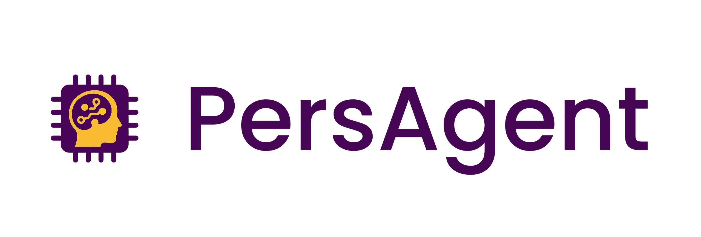
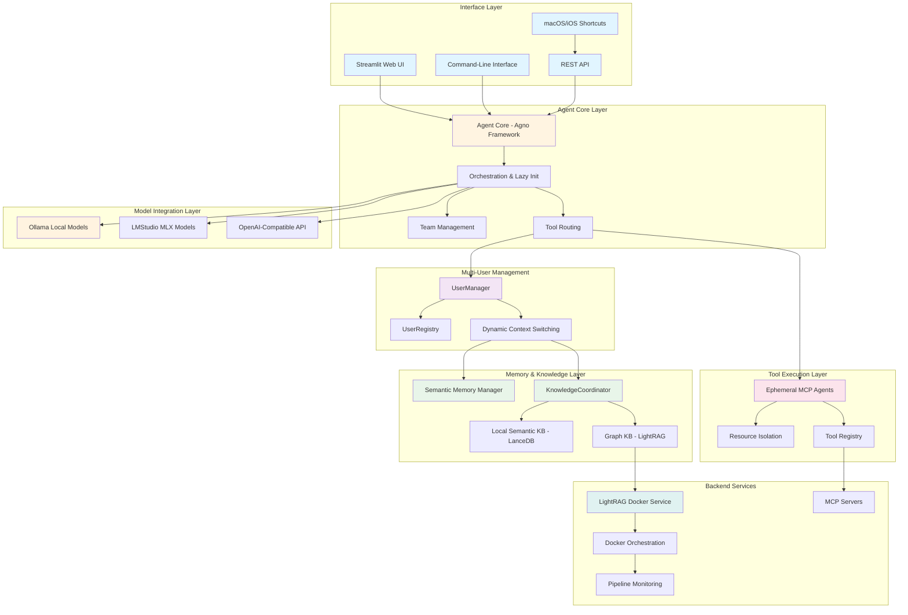
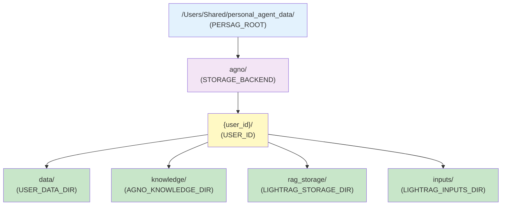

# Personal Agent System Architecture

This document outlines the architecture of the Personal Agent AI assistant, a sophisticated memory/knowledge system built on the Agno Framework. It integrates local AI models via Ollama, advanced knowledge management with LightRAG, and a dynamic multi-user environment.

## 1. Core Philosophy

The system is designed to be a modular, extensible, and powerful personal assistant that runs locally, ensuring data privacy and user control. The architecture prioritizes:

- **Modularity**: Components are decoupled and can be independently developed, tested, and upgraded.
- **Extensibility**: New tools, models, and capabilities can be easily integrated.
- **Data Privacy**: User data is stored and processed locally, with a robust multi-user system for data isolation.
- **Performance**: The system is optimized for real-time interaction and efficient use of local resources.

## 2. High-Level Architecture

The architecture can be visualized as a series of interconnected layers, each with a distinct responsibility:

### 2.1. Interfaces

This layer is the primary entry point for user interaction.

- **Streamlit Web UI (`paga_streamlit`)**: A rich, interactive web interface for managing the agent, users, and system settings. It provides a full-featured dashboard for memory synchronization, user switching, and model selection.
- **Command-Line Interface (`paga_cli`)**: A lightweight, scriptable interface for advanced users and automation. It supports all core functionalities, including agent interaction, user management, and system configuration.
- **REST API**: A comprehensive REST API for programmatic access to all agent capabilities, including memory operations, knowledge queries, and agent interactions. Enables integration with external tools and automation workflows.
- **macOS/iOS Shortcuts Integration**: Native Apple Shortcuts provide seamless mobile and desktop access to core agent functions (add memories, search knowledge, chat with agent) without requiring web interface access. Uses REST API for secure communication.
- **Tailscale Network Integration**: Secure, zero-config VPN providing encrypted remote access to the agent from any device. Enables private network connectivity without exposing services to the public internet.

### 2.2. Agent Core (Agno Framework)

The heart of the system, powered by the **Agno Framework**. This layer is responsible for:

- **Orchestration**: Managing the overall workflow of the agent or team, from receiving user input to generating a response.
- **Lazy Initialization**: The core `AgnoPersonalAgent` uses a lazy initialization pattern where the agent is created instantly without waiting for heavy components like models and memory systems to load. The actual initialization happens automatically and transparently the first time the agent is used (e.g., when `run()` is called). This eliminates the need for explicit `async initialize()` calls and simplifies agent creation, particularly in team-based scenarios.
- **Task Management**: Decomposing complex tasks into smaller, manageable steps.
- **Agent Routing**: Intelligently selecting and invoking the appropriate agents to fulfill user requests.
- **State Management**: Maintaining the agent's internal state and conversation history.

### 2.3. Memory & Knowledge Management Layer

This layer provides the agent with long-term memory and access to a structured knowledge base. It features a dual-system approach for both memory and knowledge.

- **Semantic Memory Manager**: A sophisticated system that stores and retrieves user-specific memories. It uses a hybrid approach, combining a local SQLite database for structured data and a LanceDB-powered vector store for semantic search. Memory operations are exposed as standalone functions that are registered directly as agent tools, eliminating the need for a separate tool wrapper class. User context is retrieved from the global configuration manager.
- **Dual Knowledge Base Architecture**: The system supports two distinct, parallel knowledge bases:
    - **Local Semantic KB (LanceDB)**: A fast, local vector store for semantic search on ingested documents. It uses dedicated `SemanticKnowledgeIngestionTools` for content ingestion and provides rapid similarity-based retrieval.
    - **Graph Knowledge Base (LightRAG)**: A powerful, RAG-enhanced knowledge base for storing and reasoning about complex relationships and large document collections. It uses `KnowledgeIngestionTools` and supports advanced graph-based reasoning.
- **KnowledgeCoordinator**: A central coordinator that intelligently routes queries from the `query_knowledge_base` tool to the appropriate backend. It analyzes query characteristics and user-specified modes ("local", "global", "hybrid", "naive", "auto") to determine optimal routing between local semantic search and LightRAG graph reasoning.
- **Enriched Graph Ingestion Pipeline**: Enhanced entity and relationship extraction process that improves knowledge graph construction accuracy through advanced NLP processing and file upload approaches.
- **Multi-User System**: A robust system that ensures data isolation and service stability in a multi-user environment. It dynamically manages user contexts, configurations, and services.

### 2.4. Multi-User Management Layer

This layer provides comprehensive multi-user support with dynamic context switching and data isolation:

- **UserManager**: The central orchestrator for all user-related operations including creation, switching, and deletion. Manages the complete user lifecycle and ensures proper service coordination.
- **UserRegistry**: A JSON-based registry that persistently manages rich user profiles with extended fields including demographics (gender), system roles (NPC status for bot users), and cognitive states. Uses the global configuration manager for centralized settings access instead of direct environment variables.
- **Dynamic Context Management**: Uses `~/.persag/env.userid` file as the single source of truth for the current user context. This enables runtime user switching without system restarts.
- **LightRAGManager**: A Python-native manager that controls LightRAG Docker services and dynamically injects the current `USER_ID` into service configurations.
- **Service Isolation**: Each user maintains separate data directories, memory stores, and LightRAG instances to ensure complete data isolation.
- **Operational Tools**:
  - `switch-user.py`: CLI script for creating and switching between users
  - `smart-restart-lightrag.sh`: Robust shell script that prevents port conflicts and ensures service stability during user switches

### 2.5. MCP Server Execution Architecture

The system implements a mandatory **ephemeral agent pattern** for all MCP tool interactions to ensure absolute stability:

- **Ephemeral Agent Pattern**: A required architectural pattern where each MCP tool call creates a new, single-purpose client, executes the operation, and immediately tears down the client. This is not an implementation choice but a mandatory requirement.
- **Resource Isolation**: Each tool execution is completely isolated, preventing resource conflicts and ensuring clean state between operations.
- **Stability Guarantee**: Previous experiments with persistent clients or factories proved fundamentally unstable. The ephemeral pattern provides perfect isolation and prevents resource conflicts.
- **Single-Use Lifecycle**: Create → Execute → Teardown cycle for every tool interaction, ensuring no shared state or connection pooling issues.

### 2.7. Model Integration Layer

The system supports multiple model providers through a unified interface:

- **Ollama Integration**: Primary local LLM provider supporting models like llama3.1:8b, qwen3:8b, and qwen2.5:7b-instruct. Ollama runs as a centralized LaunchAgent service (user-independent) for system-wide availability across all users.
- **LMStudio Integration**: Specialized support for MLX-optimized models on Apple Silicon (e.g., qwen3-4b-mlx), treated as OpenAI-compatible endpoints
- **OpenAI-Compatible Interface**: Unified API interface that allows seamless switching between Ollama and LMStudio models
- **Dynamic Model Switching**: Support for runtime model changes through the web interface without system restart

### 2.8. Backend Services

This layer consists of the external services that provide the agent with its core capabilities:

- **LightRAG Server**: A dedicated Docker-containerized server for knowledge management, providing a REST API for document ingestion, querying, and graph-based reasoning. Managed by LightRAGManager with per-user instances.
- **Docker Services**: Containerized service orchestration with intelligent lifecycle management, port conflict prevention, and user-specific data volume mounting.
- **MCP (Model Context Protocol) Servers**: A suite of specialized servers providing access to external tools and services (web search, filesystem, GitHub, finance, Python execution). All interactions must use the ephemeral agent pattern.
- **Pipeline Monitoring**: Real-time status tracking and health monitoring for all backend services with automated restart capabilities.

## 3. System Integration

The architecture integrates multiple specialized components through well-defined interfaces:

### 3.1. Component Integration
- **Agno Framework Integration**: Core orchestration layer that manages tool routing, state, and conversation flow
- **Docker Service Integration**: Automated lifecycle management for LightRAG and other containerized services
- **Multi-Provider Model Integration**: Seamless switching between Ollama and LMStudio model providers
- **MCP Protocol Integration**: Standardized interface for external tool and service access
- **REST API Integration**: Comprehensive API endpoints enabling programmatic access and mobile/desktop shortcuts integration
- **Tailscale Network Integration**: Secure remote access via encrypted VPN without port forwarding or public exposure

### 3.2. Data Integration
- **Cross-System Memory Sync**: Coordination between SQLite local storage and LightRAG graph memory
- **User Context Propagation**: Automatic injection of user context across all system components
- **Knowledge Base Coordination**: Intelligent routing between local semantic and graph-based knowledge systems

## 4. Security and Privacy Architecture

The system prioritizes data privacy and security through local processing and isolation:

### 4.1. Data Privacy
- **Local Processing**: All AI inference and data processing occurs locally, ensuring no data leaves the user's environment
- **User Data Isolation**: Complete separation of user data through dedicated directories and service instances
- **No External Dependencies**: Core functionality operates without external API calls or cloud services

### 4.2. Multi-User Security
- **Context Isolation**: Each user maintains completely separate memory, knowledge, and configuration contexts
- **Service Isolation**: Per-user LightRAG instances prevent cross-user data contamination
- **Dynamic Context Switching**: Secure user switching without data persistence across sessions
- **Network Security**: Tailscale integration provides encrypted, zero-trust network access without exposing services publicly
- **API Authentication**: REST API endpoints secured for authorized access from mobile shortcuts and external integrations

## 5. Data Flow

The data flow within the system is designed to be efficient and secure, incorporating the multi-user context and ephemeral tool patterns:

1.  **User Input**: The user interacts with the agent through one of the interfaces (Web UI or CLI).
2.  **User Context Resolution**: The system reads the current user context from `~/.persag/env.userid` file (via the global configuration manager) and applies user-specific configurations.
3.  **Agent Core Processing**: The Agent Core receives the input and, using the Agno Framework with lazy initialization, determines the user's intent.
4.  **Tool Selection**: The agent selects the appropriate tool(s) to handle the request. For MCP tools, it creates ephemeral clients following the mandatory stability pattern.
5.  **Memory/Knowledge Access**: If the request requires memory or knowledge access, the KnowledgeCoordinator routes queries to the appropriate backend (local semantic or LightRAG graph). All operations are user-specific.
6.  **LLM Interaction**: The agent constructs a prompt, including relevant context from memory and knowledge, and sends it to the configured LLM provider (Ollama or LMStudio).
7.  **Response Generation**: The LLM generates a response, which is then processed by the agent.
8.  **Tool Cleanup**: Any ephemeral MCP clients are immediately torn down to maintain system stability.
9.  **Output to User**: The final response is sent back to the user through the interface.

## 6. Operational Architecture

### 6.1. Service Management

The system includes sophisticated service management capabilities:

- **LightRAGManager**: Python-native Docker service controller that manages LightRAG instances per user, handles port allocation, and injects dynamic `USER_ID` configurations.
- **Smart Restart Scripts**:
  - `smart-restart-lightrag.sh`: Prevents common "port already allocated" errors by intelligently stopping, cleaning up, and restarting containers
  - Handles user context switching without service conflicts
- **Pipeline Monitoring**: Real-time status tracking of LightRAG processing pipelines with idle detection for safe memory operations.
- **Docker Integration**: Automated container lifecycle management with user-specific data volume mounting.

### 6.2. Memory Synchronization

Advanced memory consistency management across dual storage systems:

- **Dual Storage Sync**: Monitors consistency between local SQLite database and LightRAG graph memory systems.
- **Inconsistency Detection**: Automatic detection of memory mismatches between storage backends.
- **Repair Mechanisms**: Built-in repair functionality accessible through the Streamlit UI for resolving synchronization issues.
- **Memory Sync Monitoring**: Real-time status display and manual sync triggers in the web interface.

### 6.3. Configuration Management

Dynamic configuration system supporting multi-user environments:

- **Global Configuration Manager** (`PersonalAgentConfig`): Thread-safe singleton providing centralized access to all configuration settings, replacing scattered environment variable usage. Components should use `get_config()` instead of `os.getenv()`.
- **Dynamic User Context**: The `USER_ID` is managed automatically by the user system and should not be set manually in environment files.
- **User-Specific Directories**: Each user maintains separate data directories for LightRAG storage, memory databases, and input processing.
- **Service Configuration Injection**: Runtime injection of user context into Docker services and configuration files.
- **Environment Separation**: Clear separation between system-wide settings and user-specific configurations.

### 6.3.1. Environment Variables and Directory Structure

The system uses a hierarchical and user-aware set of environment variables to manage data paths, ensuring strict user isolation and maintainability. Direct usage of the base `DATA_DIR` is prohibited in application code; instead, more specific variables should be used.

**Directory Structure:**

**Environment Variables Hierarchy:**

-   **`PERSAG_ROOT`**: The absolute path to the root directory for all application data.
-   **`USER_DATA_DIR`**: The root directory for the current user's data.
-   **`AGNO_STORAGE_DIR`**: The directory for the current user's core Agno storage.
-   **`AGNO_KNOWLEDGE_DIR`**: The directory for the current user's local semantic knowledge base.
-   **`LIGHTRAG_STORAGE_DIR`**: The directory for the current user's LightRAG storage.
-   **`LIGHTRAG_INPUTS_DIR`**: The directory for the current user's LightRAG input files.

### 6.4. Management Dashboard

A comprehensive Streamlit-based web interface (`dashboard.py`) provides centralized system management and monitoring:

- **System Status Monitoring**: Real-time display of system health, service status, and resource utilization
- **User Management**: 
  - Create, update, and delete user profiles with rich demographic information
  - View and edit user details including contact information, preferences, and system roles
  - Dynamic user switching with automatic service reconfiguration
  - Support for bot users (NPC designation) for knowledge consolidation
- **Memory Management**:
  - View, search, and filter memories with dynamic human-readable timestamps
  - Add new memories directly through the interface
  - Monitor memory synchronization between local and graph storage systems
  - Repair inconsistencies between storage backends
  - Real-time memory statistics and distribution by topic
- **REST API Endpoints**: Documentation and testing interface for programmatic API access
- **Theme Support**: Light and dark mode themes for improved usability
- **Global State Integration**: Shared agent instance and session state with REST API server for consistent data access
- **Power Management**: Graceful system shutdown with confirmation dialog

The dashboard initializes a cached agent instance and updates global state to enable both UI and REST API operations. It serves as the primary administrative interface for the Personal Agent system, accessible via `poe dashboard` or direct Streamlit execution.

## 7. Deployment and Configuration

The system is designed for local deployment with emphasis on ease of use and multi-user support:

- **Dependencies**: Managed with Poetry for consistent development environments.
- **Service Orchestration**: Key services like LightRAG are managed with Docker Compose, with intelligent restart capabilities. Ollama runs as a centralized LaunchAgent service (user-independent) for system-wide access.
- **User Management**: Dynamic user creation and switching through CLI tools and web interface.
- **Network Access**: 
  - Local access via localhost interfaces
  - Secure remote access via Tailscale encrypted VPN
  - REST API for programmatic and mobile shortcuts integration
- **Configuration**:
  - System-wide settings via global configuration manager (`PersonalAgentConfig`)
  - User context managed through `~/.persag/env.userid` file
  - Dynamic service configuration injection
  - Automated directory structure creation per user

## 8. Key Architectural Decisions (ADRs)

The architecture has been shaped by critical decisions documented in Architecture Decision Records:

- **ADR-006: LightRAG Timeout Fix**: Addresses timeout issues in LightRAG operations.
- **ADR-007: Enriched Graph Ingestion Pipeline**: Enhances knowledge graph construction accuracy.
- **ADR-008: CLI Refactor**: Modularizes the CLI for improved maintainability.
- **ADR-013: Dynamic Multi-User Management**: Implements full-stack, dynamic multi-user system.
- **ADR-015: Persistent User Context**: Ensures user context persistence across sessions.
- **ADR-028: Ephemeral MCP Tool Agents**: Mandates ephemeral agent pattern for MCP tool stability.
- **ADR-029: LMStudio MLX Integration**: Adds Apple Silicon MLX model support.
- **ADR-030: Agno Role Mapping Bug Workaround**: Implements runtime patch for critical framework bug.
- **ADR-043: AgnoPersonalAgent Lazy Initialization**: Implements lazy initialization pattern.
- **ADR-044: Semantic Knowledge Ingestion and Unified Querying**: Introduces dual knowledge base architecture with unified querying.
- **ADR-096: Centralized Configuration Management**: Introduces the central runtime configuration manager for thread-safe environment variable/configuration management.

## 9. Performance and Scalability

### 9.1. Performance Optimizations
- **Lazy Initialization**: Reduces startup time by deferring resource-intensive component loading until first use
- **Dual Knowledge Base Strategy**: Optimizes query performance by routing to the most appropriate backend (fast local semantic vs. comprehensive graph reasoning)
- **Ephemeral Tool Pattern**: Prevents resource accumulation and memory leaks through immediate cleanup
- **Vector Store Optimization**: LanceDB provides high-performance local vector search with minimal overhead

### 9.2. Scalability Considerations
- **Multi-User Isolation**: Each user operates with completely isolated resources, preventing cross-user performance impact
- **Service Per User**: LightRAG instances scale horizontally with user count while maintaining data isolation
- **Docker Resource Management**: Containerized services allow for resource limits and controlled scaling
- **Local Processing**: Eliminates network latency and external API rate limits by processing everything locally

### 9.3. Resource Management
- **Memory Efficiency**: Hybrid storage approach balances performance and resource usage
- **Storage Optimization**: User-specific directories prevent data bloat and enable targeted cleanup
- **Service Lifecycle**: Smart restart scripts and monitoring prevent resource exhaustion
- **Model Switching**: Dynamic model selection allows optimization for different use cases and hardware capabilities

This architecture provides a robust, scalable foundation for a powerful, extensible, and user-centric personal AI assistant with enterprise-grade multi-user support, operational stability, and optimized performance characteristics.
