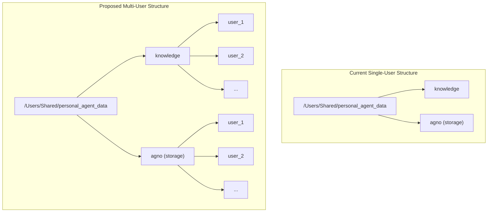

# Plan for Multi-User Knowledge Base Implementation

### **1. Goal:**
The primary objective is to create a multi-user architecture where each user has a dedicated, isolated knowledge base. This will be achieved by modifying how the knowledge base path is constructed to include a user-specific identifier, ensuring data isolation between users.

### **2. Core Strategy:**
We will leverage the existing `USER_ID` configuration setting to create user-specific subdirectories within the main knowledge base directory. This approach maintains the existing structure while extending it to support multiple users seamlessly.

The current directory structure is:
`/Users/Shared/personal_agent_data/knowledge`

The new, multi-user structure will be:
`/Users/Shared/personal_agent_data/knowledge/<USER_ID>/`

This design ensures that existing setups (e.g., using a `default_user`) continue to function without modification, while providing a clear path for scaling to multiple users.

### **3. Implementation Steps:**

**Step 1: Modify `settings.py` to Create User-Specific Paths**

We will update `src/personal_agent/config/settings.py` to dynamically construct the `AGNO_KNOWLEDGE_DIR` and `AGNO_STORAGE_DIR` paths using the `USER_ID`.

*   **Current `AGNO_KNOWLEDGE_DIR` definition:**
    ```python
    AGNO_KNOWLEDGE_DIR = os.path.expandvars(
        get_env_var("AGNO_KNOWLEDGE_DIR", f"{DATA_DIR}/knowledge")
    )
    ```

*   **Proposed Change:**
    We will modify this definition to append the `USER_ID` to the path. A similar change will be applied to `AGNO_STORAGE_DIR` to ensure all user-specific data is stored in a dedicated directory.

    ```python
    # In src/personal_agent/config/settings.py

    # ... (USER_ID definition)
    USER_ID = get_env_var("USER_ID", "default_user")

    # ...

    # Modify AGNO_STORAGE_DIR and AGNO_KNOWLEDGE_DIR to be user-specific
    AGNO_STORAGE_DIR = os.path.expandvars(
        get_env_var("AGNO_STORAGE_DIR", f"{DATA_DIR}/{STORAGE_BACKEND}/{USER_ID}")
    )
    AGNO_KNOWLEDGE_DIR = os.path.expandvars(
        get_env_var("AGNO_KNOWLEDGE_DIR", f"{DATA_DIR}/knowledge/{USER_ID}")
    )
    ```
    This centralized change will propagate throughout the application, as all modules import these settings.

**Step 2: Ensure Automatic Directory Creation**

The application must automatically create the new user-specific directories when a new user is introduced. We will investigate the storage initialization code (likely in `src/personal_agent/core/memory.py` or `src/personal_agent/core/agno_storage.py`) to confirm that directories are created using a method like `os.makedirs(..., exist_ok=True)`. If this is not the case, we will add the necessary logic to prevent errors.

**Step 3: Update Documentation (`.env.example`)**

To ensure clarity for future developers and users, we will update the `env.example` file with comments that explain the new directory structure and the role of the `USER_ID` variable.

*   **Proposed addition to `.env.example`:**
    ```
    # USER CONFIGURATION
    # The USER_ID is used to create a separate knowledge base for each user.
    # The knowledge base will be located at ${DATA_DIR}/knowledge/${USER_ID}
    # and the storage at ${DATA_DIR}/${STORAGE_BACKEND}/${USER_ID}
    USER_ID="default_user"
    ```

### **4. Visualization of the Architectural Change:**

The following diagram illustrates the transition from the current single-user structure to the proposed multi-user architecture.



### **5. Validation and Testing Strategy:**

After implementing these changes, a thorough validation process will be required:
*   **New User:** Confirm that when the application is run with a new `USER_ID`, the corresponding user-specific directories are created automatically.
*   **Data Isolation:** Verify that knowledge and data created by one user are not accessible to another.
*   **Backwards Compatibility:** Ensure that existing data for a `default_user` remains accessible when the `USER_ID` is set accordingly.