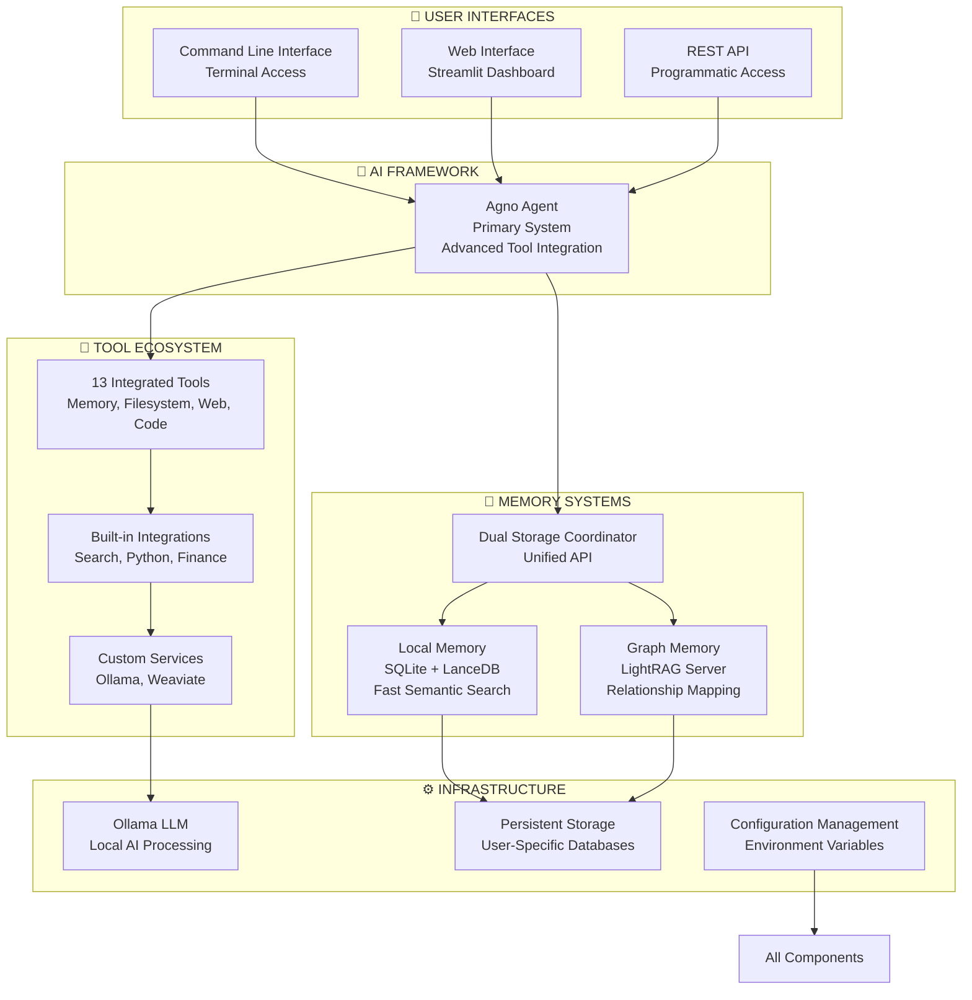

# Personal AI Agent System - Comprehensive Project Summary

## Executive Overview

The Personal AI Agent System is a sophisticated, privacy-first AI assistant built on the Agno framework that provides intelligent, persistent, and deeply personalized assistance. This system operates entirely on local infrastructure, ensuring complete data sovereignty while offering advanced capabilities through dual memory architecture, multi-framework support, and extensive tool integration.

**Key Achievements:**
- ✅ **Agno Framework**: Modern agentic AI framework with advanced tool integration
- ✅ **Dual Memory System**: Local semantic search + Graph-based knowledge representation
- ✅ **13 Integrated Tools**: Memory management, file operations, web research, code intelligence
- ✅ **Production-Ready**: Comprehensive testing, error handling, and documentation
- ✅ **Privacy-First Design**: Complete local operation with zero external data transmission
- ✅ **Extensible Architecture**: Support for additional tool integrations as needed

---

## Architecture Overview

### Core System Components

### Framework Architecture

#### Agno Framework (Current Production System)
- **Framework**: Agno Agent with advanced tool integration and lazy initialization
- **Entry Point**: `python agno_main.py`
- **Web Interface**: Enhanced Flask UI with response formatting
- **Status**: Primary production system with comprehensive testing and lazy initialization
- **Features**: Thread-safe initialization, pluggable LLM backends, comprehensive tool ecosystem

---

## Memory Architecture

### Dual Memory System

The system employs a sophisticated **Dual Memory Architecture** combining speed and relationship mapping:

#### Local Memory Layer (SQLite + LanceDB)
- **Purpose**: Fast semantic search and deduplication
- **Technology**: SQLite database with LanceDB vector storage
- **Capabilities**:
  - Semantic similarity search
  - Automatic topic classification
  - Intelligent deduplication
  - Sub-second query response times

#### Graph Memory Layer (LightRAG Server)
- **Purpose**: Complex relationship mapping and reasoning
- **Technology**: LightRAG knowledge graph with Docker containerization
- **Capabilities**:
  - Entity and relationship extraction
  - Multi-hop reasoning
  - Knowledge synthesis
  - Graph traversal queries

#### Dual Storage Coordinator
- **Location**: `src/personal_agent/core/agno_agent.py::store_user_memory()`
- **Function**: Unified API for both memory systems
- **Features**:
  - Graceful degradation (continues if one system fails)
  - Detailed status reporting
  - Automatic error recovery
  - Cross-system synchronization

### Memory Tools API

The system provides comprehensive memory management through 12 specialized tools:

#### Storage Tools
- `store_user_memory()` - Store personal information with topic classification
- `store_graph_memory()` - Store complex relationships in knowledge graph

#### Retrieval Tools
- `query_memory()` - Semantic search through memories
- `get_recent_memories()` - Time-based memory retrieval
- `get_all_memories()` - Complete memory enumeration
- `get_memories_by_topic()` - Topic-filtered memory access

#### Management Tools
- `update_memory()` - Modify existing memories
- `delete_memory()` - Remove specific memories
- `clear_memories()` - Reset all user memories
- `get_memory_stats()` - Usage statistics and analytics

---

## Tool Ecosystem

### Core Tool Capabilities

The system provides **13 integrated tools** through native implementations optimized for the dual framework architecture:

#### Memory & Knowledge Management (3 tools)
- **Memory Operations**: Store, retrieve, and manage persistent user memories
- **Knowledge Base Queries**: Semantic search through accumulated knowledge
- **Memory Analytics**: Statistics and insights into memory usage patterns

#### File System Operations (4 tools)
- **File Management**: Read, write, and manipulate files securely
- **Directory Navigation**: Browse and explore file system structure
- **Intelligent Search**: Smart file discovery with context awareness
- **Path Resolution**: Safe, validated file system operations

#### External Data Integration (5 tools)
- **Web Research**: Real-time information gathering and synthesis
- **Code Intelligence**: Repository analysis and development tools
- **Data Processing**: Analysis and transformation utilities
- **Search Integration**: Multi-source information retrieval
- **Computational Tools**: Code execution and data manipulation

#### Advanced Research (1 mega-tool)
- **Comprehensive Research**: Multi-source intelligence gathering combining all capabilities

### Extensibility Framework

The system includes support for additional tool integrations through standardized protocols, enabling future expansion of capabilities as needed.

---

## Technical Achievements

### Major Breakthroughs

#### 1. Lazy Initialization Refactoring
- **Problem**: Awkward two-step agent creation process
- **Solution**: Implemented lazy initialization with thread-safe locking
- **Impact**: Pythonic constructor usage, simplified team patterns, backward compatibility

#### 2. Dual Memory Architecture
- **Problem**: Single memory system limitations
- **Solution**: Hybrid local + graph memory with unified API
- **Impact**: Fast retrieval + complex reasoning, comprehensive coverage

#### 3. Tool Integration Architecture
- **Problem**: Framework-specific tool registration and compatibility issues
- **Solution**: Native async function integration with priority-based loading
- **Impact**: Seamless tool usage across frameworks, resolved parsing failures

#### 4. Framework Evolution
- **Problem**: Earlier framework limitations in tool integration and initialization
- **Solution**: Migration to Agno framework with lazy initialization and advanced tool support
- **Impact**: Improved reliability, better tool integration, enhanced performance

### Performance Optimizations

#### Memory Fast Path Implementation
- **Achievement**: 40s → 1s query performance improvement
- **Technology**: Query intent classification with regex patterns
- **Features**: Compound query detection, configurable thresholds, proper response typing

#### CLI Architecture Refactor
- **Achievement**: Modular CLI with improved maintainability
- **Structure**: Separated memory commands, initialization logic, and core interface
- **Benefits**: Better testability, extensibility, and organization

### Quality Assurance

#### Comprehensive Testing Suite
- **Coverage**: 20+ test files across all major components
- **Categories**: Unit tests, integration tests, MCP validation, GitHub integration
- **Tools**: Memory operations, tool discovery, web interface functionality

#### Error Handling & Resilience
- **Graceful Degradation**: System continues operating when components fail
- **Automatic Recovery**: Database corruption detection and repair
- **Comprehensive Logging**: Detailed operation tracking and debugging

---

## User Experience Features

### Web Interface
- **Framework**: Streamlit dashboard with responsive design
- **Features**:
  - Real-time conversation interface
  - Memory management dashboard
  - Tool usage monitoring
  - System status display
  - Agent configuration panel

### Command Line Interface
- **Capabilities**: Full system access through terminal
- **Features**:
  - Memory operations (store, query, delete)
  - Knowledge base management
  - System diagnostics
  - Batch processing support

### REST API
- **Endpoints**: Programmatic access to all system functions
- **Integration**: Mobile apps, automation scripts, third-party tools
- **Authentication**: Secure access with user-specific isolation

---

## Security & Privacy

### Privacy-First Architecture
- **Local Operation**: All processing occurs on user-controlled hardware
- **Data Sovereignty**: Personal information never leaves local environment
- **Zero External Dependencies**: No cloud service requirements for core functionality

### Security Measures
- **User Isolation**: Complete data separation between users
- **Encrypted Storage**: Optional encryption for sensitive data
- **Access Controls**: Secure file system operations with path validation
- **Network Security**: Local-only operation by default

---

## Recent Major Improvements (v0.9.0 - November 2025)

### 🚀 Performance & Reliability Breakthroughs
- **40x Faster Memory Queries**: Intelligent query classification routes common operations through fast-path patterns (~1s vs ~40s)
- **Atomic Configuration Transactions**: New system ensures all model/provider changes are atomic with automatic rollback on failure
- **Centralized Configuration Management**: Thread-safe singleton replaces scattered environment variables, eliminating race conditions

### 🔄 Multi-Provider LLM Support
- **Pluggable Provider Architecture**: Support for Ollama, OpenAI, LM Studio with dynamic runtime switching
- **70+ Pre-configured Model Profiles**: Standardized parameters for temperature, context sizes, and provider-specific settings
- **Streamlit Provider State Management**: Fixed state desynchronization bugs with single source of truth

### 🧠 Enhanced Memory System
- **Memory Confidence Scoring**: Every memory includes reliability score (0.0-1.0) with visual indicators for cognitive analytics
- **Proxy Agent Tracking**: Distinguishes user vs agent-generated memories with attribution tracking
- **Dual-Storage Memory Restatement**: Sophisticated two-format storage (second-person local, third-person graph) with intelligent verb conjugation

### 🌐 Production-Ready REST API
- **Comprehensive REST API**: Full programmatic access to memory and knowledge bases
- **Enhanced Health Checks**: Detailed component validation for debugging and monitoring
- **Global State Manager**: Safe agent instance sharing between Streamlit UI and REST API threads

### 🔧 Operational Excellence
- **Robust Ollama Service Management**: Migrated to macOS launchd background service with automatic startup
- **First-Run User Profile Setup**: Interactive guided setup with intelligent user_id normalization
- **Non-Interactive Installation**: Completely automated installer for CI/CD pipelines
- **Decoupled Dashboard**: Removed fragile Docker management from Streamlit for improved stability

### 📚 Knowledge Management Advancements
- **Optimized Semantic Knowledge Base Ingestion**: Batch processing with single efficient KB recreation
- **Unified Knowledge Ingestion Tools**: Consolidated 1000+ lines of duplicate code into single toolkit
- **Granite 3.1 LLM Standardization**: Apache 2.0 licensed models with optimized memory footprint
- **Dynamic Path Resolution**: Fixed critical static import issues in runtime operations

### 👥 Enhanced User Management
- **Case-Insensitive User Management**: Prevents duplicate users with automatic normalization
- **Enhanced Dashboard UI**: New tabs, reordered fields, functional user switching
- **Configuration Directory Rebranding**: `~/.persag` → `~/.persagent` for better brand alignment

---

## Future Vision

### Advanced Capabilities (Planned)

#### Personalized Learning Agent
- **Behavioral Pattern Recognition**: User preference analysis
- **Communication Adaptation**: Style matching and evolution
- **Proactive Assistance**: Anticipatory task support
- **Context Awareness**: Deep relationship and project understanding

#### Digital Brain Expansion
- **Intellectual Corpus Creation**: Complete works digitization
- **Semantic Synthesis**: Cross-reference analysis and insight generation
- **Legacy Preservation**: Comprehensive knowledge archiving
- **Interactive Access**: Conversational interaction with historical figures

### Technical Roadmap

#### Performance Enhancements
- **Local Inference Optimization**: More efficient model utilization
- **Caching Strategies**: Response and computation caching
- **Parallel Processing**: Concurrent operation optimization

#### Feature Extensions
- **Multi-Modal Integration**: Image, audio, and document processing
- **Advanced Reasoning**: Complex problem-solving capabilities
- **Collaborative Features**: Multi-user knowledge sharing

---

## Impact & Applications

### Transformative Use Cases

#### Alzheimer's Memory Preservation
- **Pre-Diagnosis Capture**: Systematic memory recording before cognitive decline
- **Progressive Support**: Memory reinforcement and recognition assistance
- **Dignity Preservation**: Identity continuity through digital memory
- **Legacy Creation**: Comprehensive digital legacy for family preservation

#### Digital Intellectual Legacy
- **Scholarly Corpus Creation**: Complete academic works digitization
- **Cross-Reference Discovery**: Hidden connection identification
- **Interactive Genius Access**: Conversational interaction with historical figures
- **Knowledge Democratization**: Universal access to intellectual heritage

### Societal Impact

#### Privacy Revolution
- **Data Sovereignty**: User control over personal information
- **HIPAA/GDPR Compliance**: Built-in privacy protection
- **Confidential Computing**: Secure local processing paradigm

#### Knowledge Preservation
- **Digital Immortality**: Eternal accessibility of human knowledge
- **Accelerated Progress**: Building upon complete intellectual foundations
- **Cultural Heritage**: Preservation of human wisdom and experience

---

## Technical Specifications

### System Requirements
- **Hardware**: Mac Mini or equivalent (M1/M2/M3 recommended)
- **Memory**: 16GB+ RAM for optimal performance
- **Storage**: 256GB+ SSD for models and data
- **Network**: Internet connection for tool operations (optional for core functionality)

### Software Dependencies
- **Python**: 3.9+ with comprehensive package ecosystem
- **Ollama**: Local LLM serving infrastructure
- **Docker**: Containerized service management
- **SQLite/LanceDB**: Local data persistence
- **LightRAG**: Graph knowledge processing

### Performance Metrics
- **Memory Query Response**: < 100ms for local searches
- **Graph Reasoning**: 1-5 seconds for complex queries
- **Tool Execution**: Variable based on operation complexity
- **System Reliability**: 99%+ uptime with graceful degradation

---

## Conclusion

The Personal AI Agent System represents a groundbreaking achievement in privacy-first AI assistance, combining sophisticated technical architecture with deep user-centric design. Through its dual framework approach, comprehensive memory system, and extensive tool integration, it provides unparalleled capabilities while maintaining complete data sovereignty.

**Key Success Factors:**
- **Architectural Innovation**: Dual memory system with Agno framework
- **Privacy-First Design**: Complete local operation paradigm
- **Extensive Integration**: 13 native tools with comprehensive capabilities
- **Production Quality**: Comprehensive testing and error handling
- **User Experience**: Intuitive interfaces and powerful capabilities

This system not only solves immediate AI assistance needs but also pioneers new paradigms for personal AI interaction, digital legacy preservation, and human knowledge management. Built on the modern Agno framework, the foundation is established for continued evolution toward increasingly sophisticated and beneficial AI capabilities.

---

*Built with privacy, powered by intelligence, designed for humanity.*