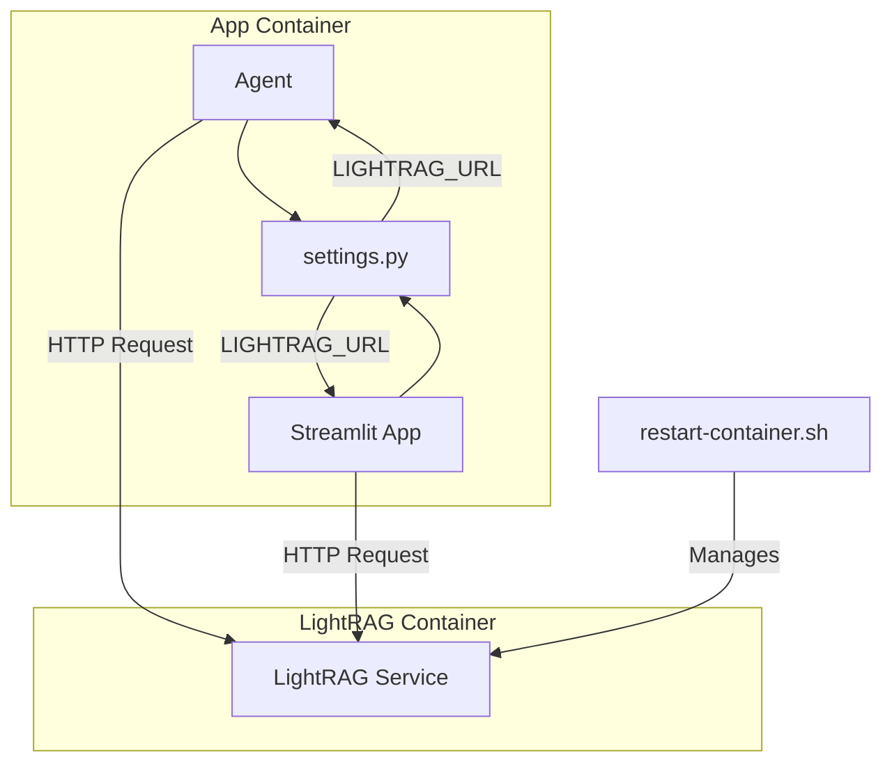

# LightRAG Decoupling Design

This document outlines the design for decoupling the LightRAG service from the main application's `docker-compose.yml` file. This will allow the LightRAG knowledge base to run in a separate, independently managed Docker container.

## 1. Strategy

The core of this design is to eliminate hardcoded URLs and introduce a centralized configuration for the LightRAG server's address. This will be achieved by adding a `LIGHTRAG_URL` environment variable. All application components will reference this variable, making the system flexible enough to connect to a LightRAG container running anywhere on the network.

Additionally, the container management script will be updated to handle a standalone container.

## 2. Implementation Steps

### Step 1: Modify `src/personal_agent/config/settings.py`

A new `LIGHTRAG_URL` setting will be added to the configuration.

```python
# src/personal_agent/config/settings.py

# ... (other imports and settings)

# LighRAG server
LIGHTRAG_SERVER = get_env_var("LIGHTRAG_SERVER", "http://localhost:9621") # DEPRECATED
LIGHTRAG_URL = get_env_var("LIGHTRAG_URL", "http://localhost:9621")

# Configuration constants - All configurable via environment variables
WEAVIATE_URL = get_env_var("WEAVIATE_URL", "http://localhost:8080")
# ... (rest of the settings)
```

### Step 2: Modify `src/personal_agent/core/agno_agent.py`

The `agno_agent.py` file will be updated to use the new `LIGHTRAG_URL` setting.

```python
# src/personal_agent/core/agno_agent.py

from ..config import (
    LLM_MODEL,
    LOG_LEVEL,
    OLLAMA_URL,
    SHOW_SPLASH_SCREEN,
    USE_MCP,
    get_mcp_servers,
    LIGHTRAG_URL, # Import the new setting
)

# ...

        async def query_knowledge_base(
            query: str, mode: str = "naive"
        ) -> dict:
            """
            Query the LightRAG knowledge base.

            :param query: The query string to search in the knowledge base
            :param mode: Query mode (default: "naive")
            :return: Dictionary with query results
            """
            url = f"{LIGHTRAG_URL}/query" # Use the new setting
            payload = {"query": query, "mode": mode}
            async with aiohttp.ClientSession() as session:
                async with session.post(url, json=payload, timeout=120) as resp:
                    resp.raise_for_status()
                    return await resp.json()

# ...

    async def query_knowledge_base(
        self, query: str, mode: str = "hybrid"
    ) -> str:
        """
        Query the LightRAG knowledge base - return raw response exactly as received.

        :param query: The query string to search in the knowledge base
        :param mode: Query mode (default: "hybrid")
        :return: String with query results exactly as LightRAG returns them
        """
        try:
            url = f"{LIGHTRAG_URL}/query" # Use the new setting
            payload = {"query": query, "mode": mode}

            # ... (rest of the function)
```

### Step 3: Modify `tools/paga_streamlit_agno.py`

The Streamlit application will also be updated to use the new `LIGHTRAG_URL` for its status checks and queries.

```python
# tools/paga_streamlit_agno.py

from personal_agent.config import (
    # ...
    LIGHTRAG_URL,
)

# ...

def render_knowledge_status(knowledge_helper):
    """Renders the status of the knowledge bases in an expander."""
    with st.expander("ℹ️ Knowledge Base Status"):
        col1, col2 = st.columns(2)
        with col1:
            st.markdown("**SQLite/LanceDB**")
            if knowledge_helper.knowledge_manager:
                st.success("✅ Ready")
            else:
                st.warning("⚠️ Offline")
        with col2:
            st.markdown("**RAG**")
            try:
                response = requests.get(f"{LIGHTRAG_URL}/health", timeout=2)
                if response.status_code == 200:
                    st.success("✅ Ready")
                else:
                    st.warning("⚠️ Offline")
            except requests.exceptions.RequestException:
                st.warning("⚠️ Offline")
```

### Step 4: Create a New Restart Script

A new script, `restart-container.sh`, will be created to manage any standalone container.

```bash
#!/bin/bash

# restart-container.sh

CONTAINER_NAME=$1

if [ -z "$CONTAINER_NAME" ]; then
  echo "Usage: $0 <container_name>"
  exit 1
fi

echo "Restarting container: $CONTAINER_NAME"

# Stop the container if it's running
if [ "$(docker ps -q -f name=$CONTAINER_NAME)" ]; then
    echo "Stopping container..."
    docker stop $CONTAINER_NAME
fi

# Remove the container if it exists
if [ "$(docker ps -aq -f name=$CONTAINER_NAME)" ]; then
    echo "Removing container..."
    docker rm $CONTAINER_NAME
fi

echo "Container $CONTAINER_NAME has been stopped and removed."
echo "You can now restart it with 'docker run' or 'docker-compose up'."
```

The old `restart-lightrag.sh` script can be removed or updated to call this new script.

### Step 5: Modify `switch-ollama.sh`

The `switch-ollama.sh` script will be updated to also switch the `LIGHTRAG_URL`.

```bash
#!/bin/bash

# ... (other variables)

# Configuration
ENV_FILE=".env"
BACKUP_DIR="backups"
LOCAL_OLLAMA_URL="http://localhost:11434"
LOCAL_OLLAMA_DOCKER_URL="http://host.docker.internal:11434"
REMOTE_OLLAMA_URL="http://tesla.local:11434"
REMOTE_OLLAMA_DOCKER_URL="http://192.168.1.126:11434"

LOCAL_LIGHTRAG_URL="http://localhost:9621"
REMOTE_LIGHTRAG_URL="http://tesla.local:9621"

# ... (functions)

# Function to update all relevant URLs in .env file
update_urls() {
    local new_ollama_url=$1
    local new_ollama_docker_url=$2
    local new_lightrag_url=$3
    local temp_file=$(mktemp)
    
    sed -e "s|^OLLAMA_URL=.*|OLLAMA_URL=$new_ollama_url|" \
        -e "s|^OLLAMA_DOCKER_URL=.*|OLLAMA_DOCKER_URL=$new_ollama_docker_url|" \
        -e "s|^LIGHTRAG_URL=.*|LIGHTRAG_URL=$new_lightrag_url|" \
        "$ENV_FILE" > "$temp_file"
    
    if grep -q "^OLLAMA_URL=$new_ollama_url" "$temp_file" && \
       grep -q "^OLLAMA_DOCKER_URL=$new_ollama_docker_url" "$temp_file" && \
       grep -q "^LIGHTRAG_URL=$new_lightrag_url" "$temp_file"; then
        mv "$temp_file" "$ENV_FILE"
        echo "✓ Updated OLLAMA_URL to: $new_ollama_url"
        echo "✓ Updated OLLAMA_DOCKER_URL to: $new_ollama_docker_url"
        echo "✓ Updated LIGHTRAG_URL to: $new_lightrag_url"
        return 0
    else
        rm "$temp_file"
        echo "✗ Failed to update URLs"
        return 1
    fi
}

# ... (main script logic)

case "$1" in
    "local")
        # ...
        if update_urls "$LOCAL_OLLAMA_URL" "$LOCAL_OLLAMA_DOCKER_URL" "$LOCAL_LIGHTRAG_URL"; then
            # ...
        fi
        ;;
        
    "remote")
        # ...
        if update_urls "$REMOTE_OLLAMA_URL" "$REMOTE_OLLAMA_DOCKER_URL" "$REMOTE_LIGHTRAG_URL"; then
            # ...
        fi
        ;;
    # ...
esac
```

## 3. Mermaid Diagram



## 4. Conclusion

This design successfully decouples the LightRAG service, making the system more modular and scalable. By using a configurable URL and a generic container management script, the application can easily adapt to different deployment environments.