# Plan to Enhance the Dual Memory System

This plan outlines the necessary modifications to propagate automatically generated topics from the local memory system to the graph memory system.

## 1. Project Goal

The primary objective is to modify the `SemanticMemoryManager` to return the list of topics (either user-provided or auto-generated) from its `add_memory` method. This returned list will then be captured in the `store_user_memory` function and passed to the `store_graph_memory` function, ensuring both memory systems are synchronized with the same topic classifications.

This change will streamline the memory creation process, especially when no topics are provided, by allowing the system to classify topics once and use them for both storage backends.

## 2. Proposed Changes

The implementation will be done in two main steps:

### Step 1: Update `SemanticMemoryManager.add_memory()`

I will modify the `add_memory` function in `src/personal_agent/core/semantic_memory_manager.py` to include the generated or passed-through topics in its return value.

*   **Current Return Signature:** `Tuple[bool, str, Optional[str]]`
    *   `(success, message, memory_id)`
*   **Proposed Return Signature:** `Tuple[bool, str, Optional[str], Optional[List[str]]]`
    *   `(success, message, memory_id, topics)`

This involves changing the `return` statements within the function to include the `topics` list.

### Step 2: Update `store_user_memory()` in `agno_agent.py`

I will update the `store_user_memory` tool located inside the `_get_memory_tools` method in `src/personal_agent/core/agno_agent.py`.

1.  **Capture Returned Topics:** The call to `self.agno_memory.memory_manager.add_memory()` will be updated to unpack the new four-element tuple, capturing the returned topics.
2.  **Propagate Topics to Graph Memory:** The captured topics will then be passed to the `store_graph_memory` function, ensuring the graph memory uses the same topics as the local memory.

## 3. Data Flow Visualization

The following Mermaid diagram illustrates the proposed change in data flow.

```mermaid
graph TD
    subgraph "🤖 AgnoPersonalAgent"
        direction LR
        SUM[store_user_memory]
    end

    subgraph "🧠 SemanticMemoryManager"
        direction TB
        AM[add_memory] --> TC[topic_classifier.classify]
        TC --> AM
    end
    
    subgraph "🕸️ Graph Memory System"
        SGM[store_graph_memory]
    end

    SUM -- "1. content, topics" --> AM
    AM -- "2. success, msg, id, <b>generated_topics</b>" --> SUM
    SUM -- "3. content, <b>generated_topics</b>" --> SGM

    style AM fill:#e1f5fe,stroke:#01579b,stroke-width:2px
    style SUM fill:#e8f5e8,stroke:#1b5e20,stroke-width:2px
    style SGM fill:#f3e5f5,stroke:#4a148c,stroke-width:2px
```

**Flow Description:**

1.  The `store_user_memory` function calls `add_memory` with the content and optional user-provided topics.
2.  If topics were not provided, `add_memory` uses the `topic_classifier` to generate them. It then returns the result, including the `generated_topics`.
3.  `store_user_memory` receives the `generated_topics` and passes them along to `store_graph_memory`.

## 4. Summary

This plan ensures that topic classification is performed only once, and the result is consistently applied across both the local and graph memory systems. This improves data integrity and simplifies the logic within the `store_user_memory` coordinator function.