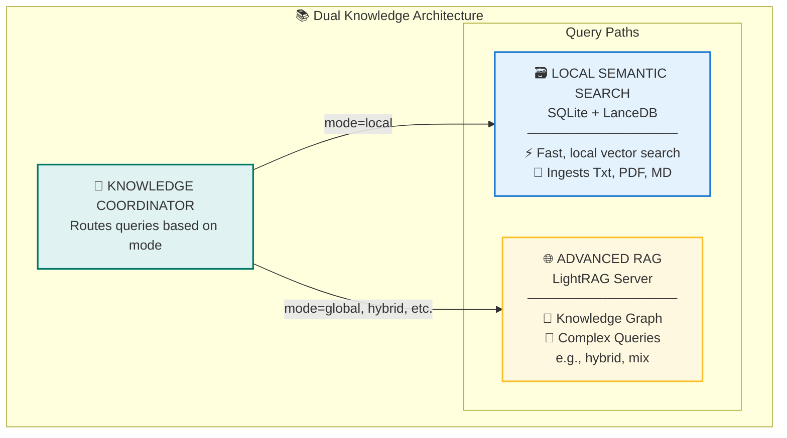

```mermaid
graph TB
    subgraph "📚 Dual Knowledge Architecture"
        KBC["🎯 KNOWLEDGE COORDINATOR<br/>Routes queries based on mode"]

        subgraph "Query Paths"
            LKB["🗃️ LOCAL SEMANTIC SEARCH<br/>SQLite + LanceDB<br/>────────────────<br/>⚡ Fast, local vector search<br/>📄 Ingests Txt, PDF, MD"]
            GKB["🌐 ADVANCED RAG<br/>LightRAG Server<br/>────────────────<br/>🔗 Knowledge Graph<br/>🧩 Complex Queries<br/>e.g., hybrid, mix"]
        end
        
        KBC -->|"mode=local"| LKB
        KBC -->|"mode=global, hybrid, etc."| GKB
    end

    style LKB fill:#e3f2fd,stroke:#1976d2,stroke-width:2px
    style GKB fill:#fff8e1,stroke:#fbc02d,stroke-width:2px
    style KBC fill:#e0f2f1,stroke:#00796b,stroke-width:2px
```
