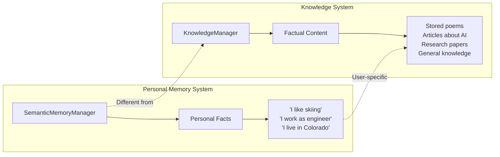

# Memory vs Knowledge Manager Flow Analysis

## Executive Summary

When you run `list all memories`, the system uses `semanticmemorymanager.get_all_memories()` instead of the knowledge manager because these are **two distinct storage systems** designed for different types of information:

- **Semantic Memory Manager**: Personal information about the user
- **Knowledge Manager**: Factual content, documents, articles, poems

## Complete Flow Diagram

```mermaid
flowchart TD
    A[User Input: 'list all memories'] --> B[reasoning_team.py]
    B --> C[CommandParser.parse_command]
    C --> D{Command Type?}
    
    D -->|Memory Command| E[Memory Agent Selected]
    D -->|Regular Chat| F[Team Coordination]
    
    E --> G[AgnoPersonalAgent]
    G --> H[PersagMemoryTools]
    H --> I[SemanticMemoryManager]
    I --> J[get_all_memories()]
    J --> K[SQLite Database Query]
    K --> L[Personal User Facts]
    
    F --> M[Knowledge Tools]
    M --> N[KnowledgeManager]
    N --> O[query_knowledge_base()]
    O --> P[Vector Database Query]
    P --> Q[Documents/Articles]
    
    L --> R[Team.aprint_response()]
    Q --> R
    R --> S[Rich Console Formatting]
    S --> T[Multiple Panels Display]
    
    T --> U[Message Panel]
    T --> V[Thinking Panel]
    T --> W[Member Response Panel]
    T --> X[Tool Calls Panel]
    T --> Y[Final Response Panel]
    T --> Z[Citations Panel]
```

## Architecture Decision Rationale

### Two-System Design



### Tool Selection Logic

The system has explicit rules in `reasoning_team.py`:

```python
"CRITICAL TOOL SELECTION RULES:",
"- Use MEMORY TOOLS for personal information ABOUT THE USER",
"- Use KNOWLEDGE TOOLS for factual content, documents, poems, stories",
"- When user asks 'what do you remember about me?' -> use get_all_memories",
"- When user asks about stored content/documents -> use query_knowledge_base",
```

## Code Flow Analysis

### 1. Command Recognition
```python
# In command_parser.py
def parse_command(self, user_input: str):
    if user_input.lower() in ['list', 'list all memories']:
        return self._handle_list_memories, None, {}
```

### 2. Memory Agent Selection
```python
# In reasoning_team.py - create_memory_agent()
memory_agent = AgnoPersonalAgent(
    model_provider=PROVIDER,
    model_name=LLM_MODEL,
    enable_memory=True,  # Key: Memory enabled
    enable_mcp=True,
    # ... other config
)
```

### 3. Tool Execution
```python
# In refactored_memory_tools.py
def get_all_memories(self) -> str:
    """Get all memories for the current user (NO PARAMETERS)"""
    return self.semantic_memory_manager.get_all_memories()
```

### 4. Database Query
```python
# In semantic_memory_manager.py
def get_all_memories(self) -> str:
    memories = self.db_manager.get_all_memories(user_id=self.user_id)
    # Returns personal facts about the user
```

## Why This Design Makes Sense

### 1. **Separation of Concerns**
- **Personal Memory**: User-specific information that personalizes interactions
- **Knowledge Base**: General factual content that can be shared or referenced

### 2. **Privacy & Security**
- Personal information is kept separate from general knowledge
- Different access patterns and security considerations

### 3. **Retrieval Optimization**
- **Memory**: Simple key-value retrieval for personal facts
- **Knowledge**: Vector similarity search for document content

### 4. **User Experience**
- "What do you remember about me?" → Personal information
- "Search for information about AI" → Knowledge base content

## The Multiple Panes Mystery Solved

The multiple panes you see in the output are generated by the **Rich console formatting** in the agno library's `Team.aprint_response()` method:

```python
# In team.py - _aprint_response_stream()
panels = []
panels.append(message_panel)      # User message
panels.append(thinking_panel)     # AI thinking
panels.append(member_response_panel)  # Member responses
panels.append(tool_calls_panel)   # Tool executions
panels.append(response_panel)     # Final response
panels.append(citations_panel)    # References
```

Each component gets its own styled panel, creating the multi-pane interface you observed.

## Conclusion

The system correctly uses `semanticmemorymanager.get_all_memories()` for the "list all memories" command because:

1. **Architectural Design**: Two separate systems for different data types
2. **User Intent**: "Memories" refers to personal information about the user
3. **Tool Selection Rules**: Explicit instructions guide the AI to use memory tools for personal info
4. **Data Separation**: Personal facts vs. general knowledge are fundamentally different

This is not a bug but a deliberate design decision that provides better user experience and data organization.
