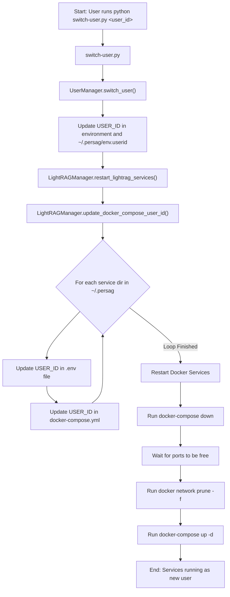

```mermaid
graph TD
    A["Start: User runs python switch-user.py &lt;user_id&gt;"] --> B["switch-user.py"]
    B --> C["UserManager.switch_user()"]
    C --> D["Update USER_ID in environment and ~/.persag/env.userid"]
    D --> E["LightRAGManager.restart_lightrag_services()"]
    E --> F["LightRAGManager.update_docker_compose_user_id()"]
    F --> G{"For each service dir in ~/.persag"}
    G --> H["Update USER_ID in .env file"]
    H --> I["Update USER_ID in docker-compose.yml"]
    I --> G
    G -->|Loop Finished| J["Restart Docker Services"]
    J --> K["Run docker-compose down"]
    K --> L["Wait for ports to be free"]
    L --> M["Run docker network prune -f"]
    M --> N["Run docker-compose up -d"]
    N --> O["End: Services running as new user"]
```
